# SSO Tools — 教务工具集开发者手册

> **版本**: v2.1 | **最后更新**: 2026-06-08

---

## 一、项目概述

重庆工商职业学院教务工具集，基于 SSO 统一认证体系，实现教务系统课表查询、二课（第二课堂）系统信息抓取、QQ 群消息自动转发、二课活动报名等功能。

### 1.1 核心功能

| 功能 | 说明 | 入口 |
|------|------|------|
| SSO 自动登录 | 自动完成 OAuth2 授权码流程，管理 token/票据生命周期 | `sso_login.py`（GUI）/ `sso_common.py` |
| 课表工具 | 获取/解析/导出学生课表，支持教室课表 | `schedule_tool.py` / `schedule/schedule_tool.py` |
| 课表图片渲染 | 将课表渲染为 PNG 周课表/日课表图片 | `schedule/schedule_image.py` |
| 成绩查询 | 通过 JWGL 接口查询学生成绩（学期筛选、课程名称搜索） | `schedule/jwgl_client.py`（`get_grades()`） |
| QQ 转发（有窗口） | OneBot v11 QQ 群消息自动转发 + #指令系统（Tkinter GUI） | `qq/qq_forward.py` |
| QQ 转发（无头版） | 命令行版 QQ 监控转发 + #指令系统 | `qq/monitor_forward.py` |
| 帮助图片 | 预渲染 #帮助 指令列表为静态图片 | `qq/help_image.py` |
| 二课积分查询 | 积分、活动计数、分类积分查询 | `secondclass/secondclass_tool.py` |
| 二课活动总表调度 | 自动定时拉取所有用户的活动总表（含 Tkinter 调度管理 GUI） | `secondclass/secondclass_scheduler.py` / `secondclass/secondclass_tool_gui.py` |
| 二课信息图 | 二课数据可视化 PNG 信息图 | `secondclass/secondclass_image.py` |
| 二课活动卡片 | 单个活动详情卡片 + 分页活动列表图 | `secondclass/secondclass_activity_chart.py` |
| 二课活动报名 | 通过验证码自动完成二课活动报名 | `secondclass/secondclass_tool.py`（`fetch_apply_page()` + `submit_activity_apply()`） |
| 二课自动积分（CLI） | 自动报名、签到、签退、提交总结的命令行自动化工具 | `secondclass_auto_score.py` |
| 二课自动积分（GUI） | 二课自动积分 Tkinter 操作界面，含积分仪表盘、批量报名、活动监控 | `secondclass_auto_score_gui.py` |
| 二课预约报名 | 预约「报名未开始」活动，到点 @ 提醒 | `qq/reservation/` 包 |
| 二课扫码签到/签退 | 拍大屏二维码图片自动识别并提交签到/签退 | `qq/sign_commands.py` + `secondclass/qr_decode.py` |
| 教室课表导出 | 教室课表 HTML 解析与 Excel 导出，支持周次选择 | `schedule/export_classroom_schedule.py` |
| 抓包代理 | mitmproxy 代理抓取 SSO 登录参数 | `sso/sso_tool.py` |
| 历史消息 | 群历史消息拉取与合并转发 | `qq/qq_history.py` |

### 1.2 运行环境

- **Python**: 3.10+
- **依赖**: `pip install -r requirements.txt`
- **操作系统**: Windows（批处理脚本）、Linux/macOS（手动启动）
- **QQ 协议**: NapCat (OneBot v11 WebSocket)

---

## 二、技术栈与架构总览

### 2.1 技术栈

| 层 | 技术 | 用途 |
|----|------|------|
| 语言 | Python 3.10+ | 所有代码 |
| GUI | Tkinter | 登录/二课调度 GUI |
| 数据库 | SQLite (`users.db`) | 用户凭证 + 二课数据持久化 |
| QQ 协议 | OneBot v11 (WebSocket) | QQ 消息收发 |
| HTTP | `requests` | SSO/二课/教务 API 请求 |
| HTML 解析 | BeautifulSoup | 二课首页 HTML 解析 |
| 图片渲染 | Pillow | 课表/二课信息图/活动卡片 PNG 渲染 |
| 抓包 | `mitmproxy` | SSO 登录参数抓取 |
| 异步 | `asyncio` + `aiohttp` | 抓包工具事件循环 |
| 线程 | `threading` | GUI 防阻塞 + 后台任务 |

### 2.2 架构总览

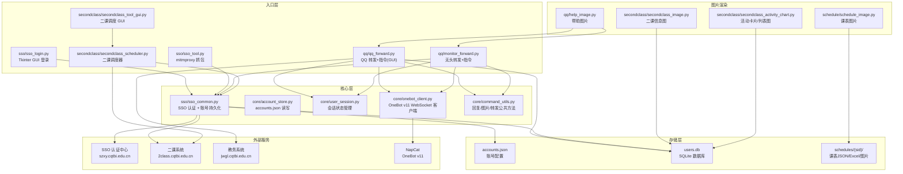
```mermaid
graph TB
    subgraph Entry["入口层"]
        SSO_LOGIN["sso/sso_login.py<br/>Tkinter GUI 登录"]
        SSO_TOOL["sso/sso_tool.py<br/>mitmproxy 抓包"]
        QQ_FWD["qq/qq_forward.py<br/>QQ 转发+指令(GUI)"]
        MON["qq/monitor_forward.py<br/>无头转发+指令"]
        SCHED["secondclass/secondclass_scheduler.py<br/>二课调度器"]
        SCHED_GUI["secondclass/secondclass_tool_gui.py<br/>二课调度 GUI"]
    end

    subgraph Core["核心层"]
        COMMON["sso/sso_common.py<br/>SSO 认证 + 账号持久化"]
        ACCT["core/account_store.py<br/>accounts.json 读写"]
        USESS["core/user_session.py<br/>会话状态管理"]
        OBCLIENT["core/onebot_client.py<br/>OneBot v11 WebSocket 客户端"]
        CMDUTILS["core/command_utils.py<br/>回复/图片/转发公共方法"]
    end

    subgraph Storage["存储层"]
        JSON["accounts.json<br/>账号配置"]
        DB["users.db<br/>SQLite 数据库"]
        SCHED_DIR["schedules/{sid}/<br/>课表JSON/Excel/图片"]
    end

    subgraph Image["图片渲染"]
        SCHED_IMG["schedule/schedule_image.py<br/>课表图片"]
        SC_IMG["secondclass/secondclass_image.py<br/>二课信息图"]
        SC_ACT["secondclass/secondclass_activity_chart.py<br/>活动卡片/列表图"]
        HELP_IMG["qq/help_image.py<br/>帮助图片"]
    end

    subgraph Services["外部服务"]
        SSO["SSO 认证中心<br/>szxy.cqtbi.edu.cn"]
        TWO_CLASS["二课系统<br/>2class.cqtbi.edu.cn"]
        JWGL["教务系统<br/>jwgl.cqtbi.edu.cn"]
        NAPCAT["NapCat<br/>OneBot v11"]
    end

    SSO_LOGIN --> COMMON
    SSO_TOOL --> COMMON
    QQ_FWD --> OBCLIENT
    QQ_FWD --> CMDUTILS
    QQ_FWD --> USESS
    QQ_FWD --> DB
    MON --> OBCLIENT
    MON --> CMDUTILS
    MON --> COMMON
    MON --> USESS
    SCHED --> COMMON
    SCHED_GUI --> SCHED
    OBCLIENT --> NAPCAT
    COMMON --> JSON
    COMMON --> DB
    COMMON --> SSO
    COMMON --> TWO_CLASS
    SCHED --> TWO_CLASS
    QQ_FWD --> JWGL
    HELP_IMG --> QQ_FWD
    HELP_IMG --> MON
    SCHED_IMG --> SCHED_DIR
    SC_IMG --> DB
    SC_ACT --> DB
```

---

## 三、命令速查

```bash
# 安装依赖
pip install -r requirements.txt

# SSO 自动登录（GUI）
python sso_login.py

# 课表工具
python schedule_tool.py

# 导出教室课表
python export_classroom_schedule.py

# QQ 转发（有窗口版）
python qq_forward.py

# QQ 转发（无头版）—— 推荐
python monitor_forward.py

# 历史消息转发
python qq_history.py

# 二课调度 GUI
python secondclass_tool_gui.py

# 二课调度器（后台）
python secondclass_scheduler.py
python secondclass_scheduler.py --once   # 只拉一次
python secondclass_scheduler.py --daemon # 后台运行

# 抓包代理
python sso_tool.py

# 启动批处理
启动工具.bat
启动二课调度器.bat

# 格式化和 Lint
ruff format .
ruff check . --fix

# 测试
python -m pytest tests/ -v
```

---

## 四、模块详解

### 4.1 `sso/sso_common.py` — SSO 共享基础

**职责**：常量、日志脱敏、账号持久化、token 换取。

**核心常量**：

| 常量 | 值 | 说明 |
|------|-----|------|
| `BASE_URL` | `http://szxy.cqtbi.edu.cn` | SSO 基础地址 |
| `APPID` | `sso20240408001` | OAuth2 应用 ID |
| `SECRET` | `002658359667427995860705420291461` | OAuth2 密钥 |
| `DATA_FILE` | `accounts.json` | 账号数据文件 |

**核心函数**：

| 函数 | 参数 | 返回 | 说明 |
|------|------|------|------|
| `load_data()` | — | `dict` | 读取 accounts.json |
| `save_data(data)` | `dict` | — | 写入 accounts.json |
| `try_auth(username, password)` | 学号, 密码 | `requests.Session` | 密码 SSO 登录，返回带 access_token 的会话 |
| `auto_qr_login()` | — | `(Session, str)` | 扫码登录，返回会话 + code |
| `exchange_token(code)` | 授权码 | `(access_token, expires_in)` | 用 code 换 access_token |
| `get_user_info(session, access_token)` | 会话, token | `dict` | 获取用户基本信息 |
| `get_portal_ticket(session, access_token)` | 会话, token | `str` | 获取门户票据 |

### 4.2 `core/account_store.py` — 账号存储

**职责**：读写 `accounts.json`，按 QQ 号关联查询。

**核心函数**：

| 函数 | 说明 |
|------|------|
| `find_account_by_qq(qq)` | 按 QQ 查找账号 |
| `find_account_by_student_id(sid)` | 按学号查找账号 |
| `save_account(qq, account_data)` | 保存或更新账号 |
| `update_account_field(qq, key, value)` | 更新单个字段 |
| `ensure_account(qq, student_id, password, ...)` | 确保账号存在（不存在则创建） |

### 4.3 `core/user_session.py` — 会话管理

**职责**：管理多步对话状态（如 #登录 的学号→密码→验证码流程）。

**会话步骤**：

| 枚举值 | 状态 | 说明 |
|--------|------|------|
| `IDLE` | 空闲 | 无进行中的对话 |
| `WAITING_STUDENT_ID` | 等待学号 | `#登录` 后等待输入学号 |
| `WAITING_PASSWORD` | 等待密码 | 学号输入后等待密码 |
| `WAITING_CAPTCHA` | 等待验证码 | 密码验证后需要验证码 |
| `WAITING_QR_SCAN` | 等待扫码 | 扫码登录中 |
| `WAITING_QR_CONFIRM` | 等待确认 | 扫码后等待确认 |
| `WAITING_UPDATE_CAPTCHA` | 更新验证码 | `#更新` 流程重新登录 |
| `WAITING_PASSWORD_UPDATE_CAPTCHA` | 密码更新验证码 | `#密码更新` 流程 |
| `WAITING_APPLY_CAPTCHA` | 报名验证码 | `#报名` 流程输入活动报名验证码 |
| `WAITING_SIGN_QR_IMAGE` | 扫码签到二维码 | `#扫码签到` 后等待用户发送大屏二维码图片 |

- 会话 5 分钟无操作自动超时
- 后台线程每 60 秒清理超时会话
- `create_or_get_session()` / `get_session()` / `remove_session()` 管理会话生命周期

### 4.4 `core/onebot_client.py` — OneBot WebSocket 客户端

**职责**：OneBot v11 正向 WebSocket 客户端封装，提供消息收发、自动重连功能。

被 `qq/qq_forward.py` 和 `qq/monitor_forward.py` 共享使用。

**核心类**：

| 类/方法 | 说明 |
|---------|------|
| `OneBotError(Exception)` | OneBot 协议/连接异常 |
| `OneBotClient(ws_url, on_event, access_token)` | WS 客户端主类 |
| `.connect()` | 建立 WebSocket 连接（daemon 线程） |
| `.disconnect()` | 断开连接 |
| `.send_group_msg(group_id, message)` | 发送群消息 |
| `.send_private_msg(user_id, message)` | 发送私聊消息 |
| `.forward_group_single_msg(group_id, message_id)` | NapCat 群消息单条转发 |
| `.send_group_forward_msg(group_id, messages)` | 发送合并转发群消息 |
| `.send_private_forward_msg(user_id, messages)` | 发送合并转发私聊消息 |
| `.get_group_list()` | 获取 Bot 加入的群列表（HTTP 同步调用） |
| `.delete_msg(message_id)` | 撤回消息 |
| `.set_log_callback(cb)` | 设置外部日志回调 |
| `.is_connected` | 是否已连接（属性） |

### 4.5 `core/command_utils.py` — 命令处理工具

**职责**：提供 qq_forward.py 和 monitor_forward.py 共享的消息回复、图片发送、文件转发等公共方法。

**核心函数**：

| 函数 | 说明 |
|------|------|
| `reply(client, msg_type, group_id, user_id, text)` | 发送文本回复（自动识别群/私聊） |
| `reply_image(client, msg_type, group_id, user_id, img_bytes, caption="")` | 发送 base64 图片 + 可选文字 |
| `forward_files(client, msg_type, group_id, user_id, files, sender_name, admin_qq)` | 以合并转发形式发送多个本地文件 |
| `forward_error(client, msg_type, group_id, user_id, error_text, admin_qq)` | 以合并转发形式发送错误日志 |

### 4.6 `sso/sso_login.py` — GUI 登录工具

基于 Tkinter 的图形界面，支持：
- 密码自动登录（自动完成验证码识别）
- 扫码登录（生成二维码，等待扫码）
- 自动管理 token 和票据生命周期

### 4.7 `sso/sso_tool.py` — 抓包代理

基于 `mitmproxy` / `mitmdump` 的抓包工具，用于捕获和解析 SSO 登录过程中的关键参数。

### 4.8 `schedule/schedule_tool.py` — 课表工具

**功能**：
- 获取学生个人课表（周次、课程、教师、教室）
- 对比课表变更
- 导出为 JSON / Excel
- `Schedule` 类：课程列表 + JSON/Excel 序列化
- `JWGLClient` 类：SSO → 门户 → JWGL 桥接 → 课表 API

**核心类**：

| 类/函数 | 说明 |
|---------|------|
| `JWGLClient` | 教务系统客户端（SSO 登录 → 门户 → JWGL 桥接 → 课表） |
| `Schedule` | 课表数据模型（courses 列表 + JSON/Excel 序列化） |
| `get_current_week_num(semester)` | 计算当前周次 |
| `render_schedule_image()` | 渲染周课表 PNG |
| `render_day_image()` | 渲染日课表卡片 |

#### 4.8.1 Excel 导出实现（`Schedule.save_excel`）

学生个人课表导出为 Excel 的实现位于 `schedule/models.py` 的 `Schedule.save_excel()` 方法：

```python
def save_excel(self, path: Path, week_start: int = 0, week_end: int = 0) -> None:
    """导出标准单表课表 Excel。
    格式：横排星期（周一~周日），纵排大节（5大节），
    每个单元格=课程名+教师+教室+周次。
    支持 period_start=0 的课程（放在对应星期行，用无名节次标记）。
    """
```

**导出流程**：

| 步骤 | 说明 |
|------|------|
| 1. 调用 `openpyxl.Workbook()` 创建工作簿 | 使用 openpyxl 库 |
| 2. 设置样式（标题、表头、数据区域） | 蓝色表头、交替行色、边框 |
| 3. 创建表头：第1行标题 + 第2行"节次/周一~周日" | 合并单元格 A1:H1 |
| 4. 按大节分组课程（5大节 + 无节次兜底） | `_period_group()` 根据 `period_start`/`period_end` 分组 |
| 5. 每个大节内按天排列，同一单元格多门课用换行分隔 | `\n` 连接课程名、教师、教室、周次、节次 |
| 6. 自动计算行高：`len(parts) * 16` | 适应换行后显示完整 |
| 7. 设置列宽（A列10，B-H列22） | `ws.column_dimensions` |
| 8. `wb.save(path)` | 输出为 `.xlsx` 文件 |

**大节分组规则**：

| 大节 | 节次范围 | 显示名 |
|------|---------|--------|
| 1 | 1-3节 | 第一节 |
| 2 | 4-5节 | 第二节 |
| 3 | 6-8节 | 第三节 |
| 4 | 9-10节 | 第四节 |
| 5 | 11-12节 | 第五节 |
| 兜底 | period_start=0 或无匹配 | 无节次 |

> 导出文件保存到 `schedules/{student_id}/{semester}.xlsx`，通过 QQ 机器人的 `#导出课表` 指令触发。

### 4.9 `schedule/jwgl_client.py` — JWGL 教务系统客户端

**职责**：封装 JWGL 教务系统的 HTTP 客户端，管理完整的 SSO → 门户 → JWGL 桥接 → 数据获取流程。

**核心类**：

`JWGLClient` 管理 `requests.Session`，实现完整的教务系统访问流程。

**核心函数/方法**：

| 类别 | 方法 | 说明 |
|------|------|------|
| SSO 登录 | `begin_sso()` | 获取 accKey + 验证码图片 |
| SSO 登录 | `refresh_captcha()` | 刷新验证码 |
| SSO 登录 | `sso_login(ucode, password, rcode)` | 学号密码登录，返回 access_token + portal_ticket |
| 门户登录 | `portal_login(ticket)` | 用 ticket 设置 PORTAL_TICKET cookie |
| JWGL 桥接 | `bridge()` | 用 PORTAL_TICKET 桥接 JWGL，获取 bzb_jsxsd cookie |
| 课表获取 | `get_schedule_html(semester, week)` | 获取课表原始 HTML |
| 课表获取 | `get_schedule(semester, week, student_id, student_name)` | 获取并解析为 `Schedule` 对象 |
| 成绩查询 | `get_grades_html(kksj, kcxz, kcsx, kcmc)` | 获取成绩原始 HTML |
| 成绩查询 | `get_grades(kksj, kcxz, kcsx, kcmc)` | 获取并解析为成绩列表 |
| 用户信息 | `get_user_info(ticket)` | 获取用户基本信息 |
| 会话检查 | `is_jwgl_valid()` | 检查 JWGL session 是否有效 |

**成绩查询参数**：

| 参数 | 说明 |
|------|------|
| `kksj` | 开课时间（学期筛选），如 `2025-2026-2`，空=全部 |
| `kcxz` | 课程性质筛选，空=全部 |
| `kcsx` | 课程属性筛选，空=全部 |
| `kcmc` | 课程名称模糊搜索，空=全部 |

**成绩返回字段**：

| 字段 | 说明 |
|------|------|
| `semester` | 学年学期 |
| `course_code` | 课程代码 |
| `course_name` | 课程名称 |
| `course_nature` | 课程性质（必修/选修） |
| `credit` | 学分 |
| `makeup_semester` | 补重学期 |
| `total_score` | 总评成绩 |
| `exam_nature` | 考试性质（正常/补考/重修） |
| `gpa` | 绩点 |

> **注意**：从 `schedule/schedule_tool.py` 中的 `JWGLClient` 重构提取而来，保留了完整的 SSO → 门户 → JWGL 桥接逻辑，并新增了成绩查询功能。

### 4.10 `export_classroom_schedule.py` — 教室课表导出

**职责**：将教室课表（`kbxx_classroom_ifr`）导出为多 sheet Excel，每周一个 sheet。

**数据源**：通过 POST 请求教务系统 `https://jwgl.cqtbi.edu.cn:81/jsxsd/kbcx/kbxx_classroom_ifr` 获取 HTML，使用 BeautifulSoup 解析。

**核心数据结构**：

| 类 | 说明 |
|----|------|
| `CourseEntry` | 一门课在某个教室/天/大节的完整信息（教室、教师、班级、课程名、周次） |
| `DaySlot` | 某天某大节的所有课程条目列表 |

**核心函数**：

| 函数 | 说明 |
|------|------|
| `fetch_html(cookie_str)` | 发送 POST 请求获取教室课表原始 HTML |
| `parse_html(html)` | 使用 BeautifulSoup 解析 HTML，返回 `list[DaySlot]` |
| `_parse_one_course(text, classroom)` | 解析单个单元格文本，提取课程名/教师/班级/周次 |
| `_expand_weeks(week_str)` | 展开周次字符串（如 "2-5,7,9-11" → `[2,3,4,5,7,9,10,11]`） |
| `export_excel(slots, path, min_week, max_week, title_place)` | 导出为竖星期、横大节、每周一个 sheet 的 Excel |
| `gui_select_weeks(slots)` | Tkinter 窗口让用户选择场所名称和周次区间 |
| `get_available_weeks(slots)` | 从解析数据中提取所有可用周次 |
| `main()` | 入口，支持 `--week`、`--weeks`、`--title`、`--gui` 参数 |

**Excel 格式**：

```
┌────────┬──────────┬──────────┬──────────┬──────────┬─ ...
│  节次\星期  │  1-3节   │  4-5节   │  6-8节   │  9-10节  │
│  星期一  │ 教室│教师│  │ 教室│教师│  │       │       │
│         │ 班级│课程  │ 班级│课程  │       │       │
│  星期二  │       │       │       │       │
│  ...    │       │       │       │       │
```

- **列布局**：星期列 + 5大节 × 4子列（教室/教师/班级/课程）
- **每周一个 sheet**：标题为"第N周"
- **样式**：蓝色大节表头、浅蓝子表头、交替行色

### 4.11 `qq/qq_forward.py` — QQ 转发（有窗口版）

**核心功能**：
- OneBot v11 WebSocket 连接（Tkinter 窗口配置 WS 地址/Token/群号）
- 群消息自动转发（源群 → 目标群）
- #指令系统
- 基于 `message_id` 去重
- 自动重连

**核心类**：

| 类/函数 | 说明 |
|---------|------|
| `QQForwardBot` | 主类（消息处理、指令路由、转发） |
| `UserDB` | users.db 的 users 表操作 |
| `handle_command()` | 指令分发 |
| `_run_async(target, *args)` | 统一后台线程启动（封装 `threading.Thread(daemon=True)`） |
| `_hit_log(text, user_id, group_id)` | 统一"指令命中"日志记录 |

**v1.7 重构要点**：
- 指令路由从散乱的 `threading.Thread(...).start()` 改为集中使用 `_run_async()` 统一封装
- 新增 `_hit_log()` 替代各指令分支中的 `self._log("info", f"指令命中: {text}...")`
- 指令路由逻辑扁平化为分类式 if-else（登录类、课表类、二课类、管理员类）
- `#登录` 指令改为同步调用 `_start_login_session()`
- 管理员权限判断逻辑重构（先判定管理员指令，非管理员直接拒绝）

> OneBot 底层连接使用 `core/onebot_client.OneBotClient`，消息回复工具使用 `core/command_utils`。

### 4.12 `qq/monitor_forward.py` — 无头版转发

命令行版无 GUI，功能与 `qq_forward.py` 一致，从 `forward_config.json` 加载配置。

**核心类**：

| 类/函数 | 说明 |
|---------|------|
| `MonitorForwarder` | 主类（WebSocket 连接、消息转发、自动重连） |
| `CommandHandler` | #指令路由和执行（含 `simple_routes` 字典分发） |

**v1.7 重构要点**：
- 指令分发从逐个 `threading.Thread(...).start()` 改为集中式 `simple_routes` 字典 + `_cmd_*` 方法
- `#帮助` 和 `#取消` 改为同步执行（不再启动后台线程）
- `CMD_MY_ER` 指令修复：之前未注册到调度表，现已正确加入 `simple_routes`
- 非线程指令（`#报名` 带参数 / `#刷新验证码` / 管理员指令等）保持原有异步逻辑
- `import re` 移到文件顶部，函数内不再重复导入

> OneBot 底层连接使用 `core/onebot_client.OneBotClient`，消息回复工具使用 `core/command_utils`。

### 4.13 `qq/qq_history.py` — 历史消息

拉取群历史消息并生成合并转发消息。

### 4.14 `qq/help_image.py` — 帮助图片渲染

将 #帮助 指令列表渲染为静态 PNG 图片，替代纯文本回复。

**设计特点**：
- **渲染与发送分离**：模块首次导入时自动预渲染两个版本（普通用户/管理员）的帮助图片
- **旧缓存自动清理**：指令列表变更后重启进程即可刷新，旧缓存文件（文件名含 MD5 哈希）自动清理
- 依赖 Pillow，已存在于项目依赖中

**核心接口**：

| 函数 | 说明 |
|------|------|
| `get_help_image(is_admin=False)` | 返回已预渲染的帮助图片文件路径 |

**缓存路径**：`_temp/help_images/help_{hash}_{user|admin}.png`

### 4.15 `secondclass/secondclass_tool.py` — 二课系统核心

**核心类**：

| 类 | 数据表 | 主键 | 说明 |
|-----|--------|------|------|
| `SecondClassDB` | `second_class_v2` | `student_id` | 二课积分快照 |
| `SecondClassMasterDB` | `second_class_master_v2` | `(student_id, activity_id)` | 活动总表 |
| `SecondClassUserActivityDB` | `second_class_user_activities` | `(student_id, activity_id)` | 用户未结束活动（报名中+活动中+未开始） |
| `SecondClassActivityDetailDB` | `second_class_activity_detail_v3` | `activity_id` | 活动详情 |

**核心函数**：

| 函数 | 说明 |
|------|------|
| `obtain_secondclass_session_from_user(user)` | 从 user dict 获取二课 SSID 会话 |
| `fetch_all_with_session(sess, ...)` | 一站式抓取积分+活动计数+分类积分+时长 |
| `fetch_and_save_secondclass_info(user_id, user)` | 抓取并保存用户二课信息（统一入口） |
| `fetch_and_store_master_data(sess, student_id, ...)` | 抓取并保存活动总表（可报名活动，不再拉取我的活动） |
| `fetch_and_store_my_unfinished_activities(sess, ...)` | 拉取"我的活动"未结束标签页（报名中+活动中+未开始）存入独立表 |
| `fetch_activities_can_apply(sess, ...)` | 获取可报名活动列表 |
| `fetch_all_my_activities(sess)` | 获取"我的活动"所有标签页（旧函数，被调度器不再直接调用） |
| `fetch_activity_detail_page(sess, activity_id)` | 获取单个活动详情（apply.html）并全面解析 |
| `fetch_and_store_all_activity_details(sess, ...)` | 批量拉取活动详情并存入 DB |
| `fetch_and_save_activity_detail(sess, ...)` | 单个活动详情获取+保存 |
| `fetch_apply_page(sess, activity_id)` | 获取活动报名页面，提取隐藏字段 s1/s2，检测是否可报名 |
| `submit_activity_apply(sess, activity_id, captcha_code, s1, s2)` | 提交活动报名请求（返回 `{"success": bool, "message": str}`） |
| `format_secondclass_summary(data)` | 格式化为 QQ 可读文本 |
| `format_activity_detail(detail)` | 格式化活动详情 |
| `format_activity_summary(activities)` | 格式化活动列表 |

**DB 方法**：

| 方法 | 类 | 说明 |
|------|----|------|
| `upsert(qq, **data)` | `SecondClassDB` | 更新/插入积分快照 |
| `get_by_qq(qq)` | `SecondClassDB` | 按 QQ 查询 |
| `get_by_student_id(sid)` | `SecondClassDB` | 按学号查询 |
| `upsert_activities(sid, activities, qq)` | `SecondClassMasterDB` | 批量 upsert 活动 |
| `get_by_student_id(sid)` | `SecondClassMasterDB` | 按学号查所有活动 |
| `delete_by_activity_id(aid)` | `SecondClassMasterDB` | 按活动 ID 删除 |
| `get_unfetched_activity_ids()` | `SecondClassActivityDetailDB` | 获取未拉取详情的活动 ID |
| `get_by_activity_id(aid)` | `SecondClassActivityDetailDB` | 按活动 ID 查详情 |
| `delete_by_activity_id(aid)` | `SecondClassActivityDetailDB` | 按活动 ID 删除详情 |
| `upsert(activity_id, **kw)` | `SecondClassActivityDetailDB` | 插入/更新活动详情 |

**校验逻辑**：在 `fetch_and_store_all_activity_details()` 和 `fetch_and_save_activity_detail()` 中，如果解析出的 `activity_name` 为空，会记录 `log.error` 并**仅清理 detail 记录**，**保留 master 记录**（master 来自"我的活动"等合法来源，不应因详情页解析失败而被删除）。

### 4.15.1 活动总表（`second_class_master_v2`）录入逻辑与数据流

`second_class_master_v2` 表存储二课系统的活动总表数据，当前仅包含可报名活动（我的活动已分离到独立表）。

#### 录入入口

核心函数 `fetch_and_store_master_data()` 是**唯一统一入口**，在调度器和 QQ 指令中被调用。内部按顺序执行以下步骤：

| 步骤 | 函数 | 数据来源 | 写入方式 |
|------|------|----------|----------|
| **1. 可报名活动** | `fetch_activities_can_apply()` | `POST /Student/Activity/getActivityCanApply.html` | `master_db.upsert_activities()` |
| **2. 活动详情**（可选） | `fetch_and_store_all_activity_details()` | `GET /Student/Activity/apply.html?activityID=xxx` | `detail_db.upsert()` 写入 v3 表 |
| **3. 扫描新活动**（可选） | `discover_new_activities()` | 遍历 activity_id 范围试探 | `master_db.upsert_activities()` |

#### 数据流向

```
fetch_and_store_master_data(sess, student_id, qq, ...)
 │
 ├─ Step 1: fetch_activities_can_apply()
 │   POST /Student/Activity/getActivityCanApply.html
 │   请求参数: moduleID, typeID, keywords, sortByTime, sortByScore
 │   响应解析: 支持多种 JSON 格式（数组 / {rows} / {data}）
 │   → SecondClassMasterDB.upsert_activities() 批量写入
 │
 ├─ Step 2 (可选, fetch_details=True): fetch_and_store_all_activity_details()
 │   └→ 见 §4.15.2
 │
 └─ Step 3 (可选, scan_new=True): discover_new_activities()
     遍历 activity_id=[1..scan_range] 探测新活动
     → 写入 master 表
```

> **注**：旧版 Step 2（`fetch_all_my_activities()` 写入 master 表）已移除。我的活动未结束数据（报名中+活动中+未开始）改为写入独立表 `second_class_user_activities`，由调度器通过 `fetch_and_store_my_unfinished_activities()` 拉取。

#### `fetch_activities_can_apply()` 详情

- **URL**: `POST https://2class.cqtbi.edu.cn/Student/Activity/getActivityCanApply.html`
- **请求体**: `moduleID`, `typeID`, `keywords`, `sortByTime`, `sortByScore`
- **响应格式支持**: 数组、`{rows: [...]}`、`{data: [...]}` 等
- **字段提取**: 调用 `_parse_activity_entry()` 解析每个活动的 JSON 字段
- **去重**: 返回已去重的活动列表（基于 `activity_id`）

#### `fetch_all_my_activities()` 详情

- **入口**: `GET https://2class.cqtbi.edu.cn/Student/My/myActivity.html`
- **服务端渲染标签页**（直接解析 HTML 表格行）:
  - `tab=1` 报名中 → `status_code=3`
  - `tab=2` 活动中 → `status_code=5`
  - `tab=5` 未开始 → `status_code=0`（语义：已报名但未开始，区别于 API 的"草稿"）
- **AJAX 分页标签页**（POST 请求，`pageNo` 分页，最多 5 页）:
  - `tab=3` 已结束 → `POST myActivity_End.html`
  - `tab=4` 其它 → `POST myActivity_other.html`
- **响应格式**: `[maxID, [activity1, activity2, ...]]`
- **返回**: `{"报名中": [...], "活动中": [...], "已结束": [...], "其它": [...], "未开始": [...]}`

#### `SecondClassMasterDB.upsert_activities()` 写入逻辑

- 批量逐条执行 `INSERT ... ON CONFLICT(student_id, activity_id) DO UPDATE SET ...`
- 更新字段：`activity_name`, `module_name`, `score`, `organizer`, `start_date`, `end_date`, `apply_start`, `apply_end`, `status_code`, `status_name`, `is_closed`, `fetched_at`
- 使用线程锁 `self._lock` 保证并发安全
- 日志输出 "活动总表已保存，共 N 条记录"

---

### 4.15.2 活动详情表（`second_class_activity_detail_v3`）录入逻辑与数据流

`second_class_activity_detail_v3` 表存储每个活动的详细页面信息，来源于 `apply.html` 页面解析。

#### 录入入口

有 **3 个入口** 写入 v3 表：

| 入口 | 函数 | 触发场景 | 数据量 |
|------|------|----------|--------|
| **A** | `fetch_and_save_activity_detail()` | QQ 指令 `#<活动ID>` 实时查询，缓存未命中时调用 | 单个活动 |
| **B** | `fetch_and_store_all_activity_details()` | 调度器 `fetch_details=True` 时，或 `#更新` 指令 | 批量（unfetched + reparse） |
| **C** | `discover_new_activities()` 间接 | 扫描新活动时，成功获取详情也写入 v3 表 | 单个活动 |

#### 数据流向

```
入口 A (实时): fetch_and_save_activity_detail(sess, activity_id)
 │ 被调用于: QQ 转发器 #<活动ID> 指令
 │
入口 B (批量): fetch_and_store_all_activity_details(sess, student_id, ...)
 │ 被调用于: fetch_and_store_master_data() Step 3
 │
 ├─ 1. 获取待拉取列表
 │   get_unfetched_activity_ids() → LEFT JOIN 查询 master 表有但 detail 表无的 activity_id
 │   get_need_reparse_activity_ids() → 查询 category_name / implementation_method 为空的旧记录
 │
 ├─ 2. 逐个获取详情 (间隔 3 秒)
 │   fetch_activity_detail_page(sess, activity_id)
 │   │  GET /Student/Activity/apply.html?activityID=xxx
 │   │  异常检测: "活动不存在" / "跳转提示" / "无权" / "404"
 │   │
 │   │  三层解析策略:
 │   │   ├─ 策略 A: _parse_detail_by_adjacent_labels()
 │   │   │   按文本行遍历，匹配 _LABEL_FIELD_MAP 标签名
 │   │   │   提取: 类别, 实施方式, 概述, 主办方, 联系电话, 地点, 时长,
 │   │   │         报名方式, 人数上限/当前, 限制学院/年级, 需签退/总结,
 │   │   │         主办方需总结, 取消时限, 定位签到, 附件, 主图,
 │   │   │         报名时间, 活动时间
 │   │   │
 │   │   ├─ 策略 B: _fallback_regex_parse()
 │   │   │   策略 A 失败时的正则回退，提取关键字段
 │   │   │
 │   │   └─ 策略 C: BeautifulSoup 结构提取
 │   │       主图、状态、<ul.mui-table-view> 列表项
 │   │
 │   └─ 校验: activity_name 为空 → log.error + 删除无效 detail 记录
 │
 └─ 3. 保存到 DB
     detail_db.upsert(activity_id=xxx, activity_name=xxx, ...)
     → INSERT ... ON CONFLICT(activity_id) DO UPDATE SET ...
```

#### `_LABEL_FIELD_MAP` 标签→字段映射

`_LABEL_FIELD_MAP`（第 1901-1925 行）定义了 22 个标签名与 DB 字段的对应关系：

| 标签（HTML 文本） | DB 字段 | 说明 |
|-------------------|---------|------|
| 类别 | `category_name` | 活动类别名称 |
| 实施内容与方式 / 实施内容与目标 | `implementation_method` | 实施方式 |
| 实施内容与方式： / 活动实施内容与方式： | `implementation_method` | 含冒号的变体 |
| 概述 | `overview` | 活动概述文本 |
| 主办方 | `organizer` | 主办方名称 |
| 联系电话 | `contact_phone` | 联系电话 |
| 活动地点 | `location` | 地点 |
| 发放时长 / 时长 | `duration` | 时长描述 |
| 报名方式 | `signup_method` | 报名方式 |
| 人数上限 | `max_participants` | 人数上限 |
| 当前人数 | `current_participants` | 当前已报名人数 |
| 限制学院 | `limit_college` | 学院限制 |
| 限制年级 | `limit_grade` | 年级限制 |
| 需签退 | `need_sign_out` | 是否需要签退 |
| 需总结 / 需要提交总结/心得 | `need_summary` | 是否需要提交总结 |
| 主办方需总结 | `organizer_need_summary` | 主办方是否需要总结 |
| 取消时限 | `cancel_time_limit` | 取消报名时限 |
| 定位签到 | `location_sign` | 是否需要定位签到 |
| 附件 | `attachment` | 附件信息 |
| 主图 | `main_image` | 主图文件名 |
| 报名时间 | `apply_time` | 报名时间范围 |
| 活动时间 | `activity_time` | 活动时间范围 |

#### 关键辅助方法

| 方法 | 说明 |
|------|------|
| `get_unfetched_activity_ids()` | `LEFT JOIN` 查询 master_v2 中有但 detail_v3 中无的 `activity_id` |
| `get_need_reparse_activity_ids()` | 查询 `category_name` 或 `implementation_method` 为空的旧版记录（需重新解析以获取更多字段） |
| `get_by_activity_id(aid)` | 按 `activity_id` 查询单条详情 |
| `delete_by_activity_id(aid)` | 删除单条详情（用于空活动名清理） |

---

### 4.15.3 数据流全景图

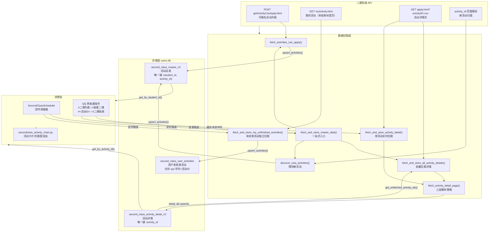
```mermaid
flowchart TB
    subgraph External["二课系统 API"]
        CAN_APPLY["POST getActivityCanApply.html<br/>可报名活动列表"]
        MY_ACT["GET myActivity.html<br/>我的活动（未结束标签页）"]
        DETAIL["GET apply.html?activityID=xxx<br/>活动详情页"]
        SCAN["activity_id 范围探测<br/>新活动扫描"]
    end

    subgraph Fetch["数据拉取层"]
        FMS["fetch_and_store_master_data()<br/>一站式入口"]
        FCAN["fetch_activities_can_apply()"]
        FUNFIN["fetch_and_store_my_unfinished_activities()<br/>未结束活动独立拉取"]
        FDETAIL["fetch_and_store_all_activity_details()<br/>批量拉取详情"]
        FSAD["fetch_and_save_activity_detail()<br/>单活动实时拉取"]
        FDISCOVER["discover_new_activities()<br/>探测新活动"]
        FDP["fetch_activity_detail_page()<br/>三层解析策略"]
    end

    subgraph Storage["存储层 users.db"]
        MASTER["second_class_master_v2<br/>活动总表<br/>唯一键: (student_id, activity_id)"]
        USER_ACT["second_class_user_activities<br/>用户未结束活动<br/>仅存 qq+学号+活动ID"]
        DETAIL_DB["second_class_activity_detail_v3<br/>活动详情<br/>唯一键: activity_id"]
    end

    subgraph Consumer["消费层"]
        SCHED["SecondClassScheduler<br/>定时调度器"]
        QQ_CMD["QQ 转发器指令<br/>#二课列表 / #查看二课<br/>#<活动ID> / #二课图表"]
        IMAGE["secondclass_activity_chart.py<br/>活动卡片/列表图渲染"]
    end

    External --> Fetch

    FMS --> FCAN
    FMS --> FDETAIL
    FMS --> FDISCOVER

    CAN_APPLY --> FCAN
    MY_ACT --> FUNFIN
    DETAIL --> FDETAIL
    DETAIL --> FSAD
    SCAN --> FDISCOVER

    FDETAIL --> FDP
    FSAD --> FDP

    FCAN -->|"upsert_activities()"| MASTER
    FUNFIN -->|"upsert_activities()"| USER_ACT
    FDISCOVER -->|"upsert_activities()"| MASTER

    FDP -->|"detail_db.upsert()"| DETAIL_DB

    MASTER -->|"get_by_student_id()"| Consumer
    DETAIL_DB -->|"get_by_activity_id()"| Consumer
    DETAIL_DB -->|"get_unfetched_activity_ids()"| FDETAIL

    SCHED -->|"定时触发"| FMS
    SCHED -->|"定时触发"| FUNFIN
    QQ_CMD -->|"按需触发"| FMS
    QQ_CMD -->|"缓存未命中时"| FSAD
    Consumer --> IMAGE
```

---

### 4.16 `secondclass/secondclass_scheduler.py` — 二课调度器

自动定时拉取所有已配置用户的二课活动总表和详情，支持增量更新。

**调度逻辑**：

1. 读取 accounts.json + users.db 获取所有用户凭证（同 student_id 去重，accounts.json 覆盖 users 表）
2. 遍历每个用户，调用 `obtain_secondclass_session_from_user()` 获取 SSID 会话
3. 调用 `fetch_and_store_master_data(sess, student_id, qq, fetch_details=True, max_detail_activities=10, include_reparse=True, scan_new=True, scan_range=50)` 一站式拉取：
   - 可报名活动列表（写入 master 表）
   - 活动详情（批量拉取 unfetched + reparse 记录，写入 detail 表）
   - 新活动探测（扫描 activity_id 范围）
4. 调用 `fetch_and_store_my_unfinished_activities(sess, student_id, qq)` 拉取用户未结束活动（报名中+活动中+未开始），写入独立表
5. 按调度间隔重复

**调度策略**：

| 时段 | 间隔 |
|------|------|
| 周二 06:00-22:00 | 15 分钟 |
| 周三 06:00-17:00 | 15 分钟 |
| 周二至周三其余时间 | 30 分钟 |
| 其它日子 | 3 小时 |

**详情拉取限制**：`max_detail_activities=10` 限制每次调度最多拉取 10 个活动详情，避免单次请求过多触发反爬。`include_reparse=True` 时同时补充旧版解析不完整的记录。

### 4.17 `secondclass/secondclass_tool_gui.py` — 二课调度 GUI

基于 Tkinter 的二课调度器图形界面，支持：
- 调度策略指示器
- 已登录用户列表
- 启动/停止调度按钮
- 运行状态面板
- 日志显示区

### 4.18 `secondclass/secondclass_image.py` — 二课信息图

使用 Pillow 将二课数据渲染为 9:16 竖版 PNG 信息图。

**布局**：
1. 头部信息（姓名、学号、班级、学院）
2. 二课总分环形进度图
3. 活动概况堆叠条（已完成/未签到/未提交 + 社团数量）
4. 累计志愿时长
5. 分类积分四边形雷达图（思想政治/劳动教育/文艺美育/志愿服务）
6. 及格要求提示

**输出**：默认保存到 `schedules/{student_id}/secondclass.png`

### 4.19 `secondclass/secondclass_activity_chart.py` — 活动卡片/列表渲染

使用 Pillow 渲染单个活动详情卡片或活动分页列表图。

**功能**：

| 函数/类 | 说明 |
|---------|------|
| `ActivityCardRenderer` | 单个活动详情卡片（400x600 PNG） |
| `render_activity_card(detail)` | 渲染单张活动卡片 → `schedules/_activity_charts/{id}.png` |
| `ActivityListRenderer` | 活动分页列表（每图最多10个） |
| `render_activity_list(activities, page)` | 渲染一页列表图 → `schedules/_activity_list_charts/activity_list_p{page}.png` |
| `render_all_activity_lists(activities)` | 自动分页渲染所有活动，返回所有图片路径 |

**卡片内容**：活动名称、活动ID、状态、积分、模块、报名时间、活动时间、地点、时长、签退/总结设置、活动概述
**列表内容**：活动ID、活动名称、报名时间/活动时间、模块、积分、状态

### 4.20 `sso_to_ssid.py` — SSID 转换工具

**职责**：将 SSO 凭证（`access_token` + `portal_ticket`）转换为二课系统的 `SSID` cookie 值，提供 CLI 和可编程接口。

**核心函数**（位于 `secondclass/secondclass_tool.py`）：

| 函数 | 说明 |
|------|------|
| `convert_to_ssid(access_token, portal_ticket, *, student_id="")` | 将 access_token + portal_ticket 转化为 SSID cookie 值。返回 SSID 字符串，失败返回空串。 |

**CLI 用法**：

```bash
# 从 accounts.json 提取第一个可用账号
python sso_to_ssid.py accounts.json

# 指定 QQ 号提取
python sso_to_ssid.py accounts.json --qq 3200418862

# 从 stdin 传入 JSON
echo '{"access_token":"xxx","portal_ticket":"xxx"}' | python sso_to_ssid.py

# 从环境变量
set SSO_ACCESS_TOKEN=xxx & set SSO_PORTAL_TICKET=xxx
python sso_to_ssid.py

# 直接传入 JSON 字符串
python sso_to_ssid.py --json '{"access_token":"xxx","portal_ticket":"xxx"}'
```

**转换流程**：

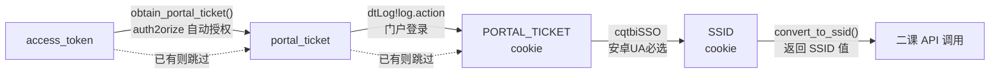
```mermaid
flowchart LR
    A["access_token"] -->|"obtain_portal_ticket()<br/>auth2orize 自动授权"| B["portal_ticket"]
    B -->|"dtLog!log.action<br/>门户登录"| C["PORTAL_TICKET<br/>cookie"]
    C -->|"cqtbiSSO<br/>安卓UA必选"| D["SSID<br/>cookie"]
    A -.->|"已有则跳过"| B
    B -.->|"已有则跳过"| C
    D -->|"convert_to_ssid()<br/>返回 SSID 值"| E["二课 API 调用"]
```

**输出**：
```
student_id=2403740
access_token=671108d1…
portal_ticket=00276dbb…
SSID=e8f3a1b2c4d5a6b7c8d9e0f1a2b3c4d5
```

> 此工具依赖 `secondclass/secondclass_tool.py` 中的 `convert_to_ssid()` 函数，复用完整的 SSO→门户→二课桥接逻辑。

### 4.21 `secondclass_auto_score.py` — 二课自动积分工具

**职责**：二课积分的全自动管理工具，支持批量报名（含验证码自动识别）、签到/签退/总结提交监控。

**用法**：

| 命令 | 说明 |
|------|------|
| `python secondclass_auto_score.py status` | 查看积分仪表盘（模块达标情况） |
| `python secondclass_auto_score.py signup` | 批量报名活动（含 ddddocr 验证码识别） |
| `python secondclass_auto_score.py signup --dry-run` | 仅显示可报名活动，不实际报名 |
| `python secondclass_auto_score.py signup --max 5` | 最多报名5个活动 |
| `python secondclass_auto_score.py probe` | 探测签到/签退/总结的API端点 |
| `python secondclass_auto_score.py summary` | 批量提交活动总结（自动生成总结文本） |
| `python secondclass_auto_score.py monitor` | 启动签到/签退/总结监控循环 |
| `python secondclass_auto_score.py run` | 全自动模式（先报名，再监控） |

**核心函数**：

| 函数/类 | 说明 |
|---------|------|
| `cmd_status()` | 积分仪表盘：显示各模块当前/需要/差距、总积分、总时长 |
| `cmd_signup()` | 批量报名：分析积分缺口 → 过滤可报名活动 → 自动识别验证码 → 提交报名 |
| `auto_signup_activity(sess, activity_id)` | 单个活动自动化报名（含 ddddocr 验证码识别，支持重试） |
| `filter_eligible_activities(activities, ...)` | 过滤可报名的活动（学院/年级/模块缺口/权限检查） |
| `cmd_probe()` | 端点探测：系统性探测签到/签退/总结的 API 端点 |
| `probe_endpoints(sess, activity_id)` | 对候选 URL 发送 POST 请求，记录有效响应 |
| `cmd_summary()` | 批量提交总结：获取需总结的活动 → 自动生成 → 提交 |
| `submit_activity_summary(sess, activity_id, text)` | 两步提交总结：GET页面获取session → POST multipart 提交 |
| `generate_activity_summary(activity)` | 根据活动信息随机生成总结文本（3种模板） |
| `cmd_monitor()` | 启动 `ActivityMonitor` 监控循环 |
| `ActivityMonitor` | 监控器类：定时检查并自动签到(GPS)/签退/提交总结 |
| `fetch_my_activities_needing_action(sess)` | 获取需要签到/签退/总结的活动列表 |
| `submit_activity_sign_in(sess, activity_id, ...)` | 提交活动签到（支持GPS定位） |
| `submit_activity_sign_out(sess, activity_id, ...)` | 提交活动签退 |

**依赖**：

| 依赖 | 用途 |
|------|------|
| `ddddocr` | 验证码自动识别（可选，不安装则需手动输入） |

**配置**：存储在 `_temp/auto_score_config.json`

| 配置项 | 默认值 | 说明 |
|--------|--------|------|
| `year_term` | `20252026-2` | 学年学期 |
| `campus_latitude` / `campus_longitude` | `29.97` / `106.27` | GPS签到坐标 |
| `poll_interval_seconds` | `60` | 监控轮询间隔 |
| `signup_delay_seconds` | `3.0` | 报名间隔（含随机抖动） |
| `max_captcha_retries` | `3` | 验证码识别重试次数 |
| `skip_location_sign_in` | `True` | 是否跳过GPS签到 |
| `skip_captcha` | `False` | 是否跳过验证码 |

**状态文件**：`_temp/auto_score_state.json`，记录已处理的活动ID和最后扫描时间。

### 4.22 `qq/reservation/` — 二课预约报名模块

**职责**：独立的预约报名包，为 `#预约报名 <活动ID>` 和 `#我的预约` 提供后端支持。

**结构**：

| 文件 | 类/函数 | 职责 |
|------|---------|------|
| `qq/reservation/__init__.py` | — | 模块入口，暴露 `ReservationDB`、`ReservationScheduler`、`ReservationCommands`、`parse_apply_start` |
| `qq/reservation/db.py` | `ReservationDB` | 存储层，复用 `second_class_users` 表的 `reserved_activity_ids` / `reservations_meta` 两列 |
| `qq/reservation/commands.py` | `ReservationCommands` | 业务逻辑：`handle_reserve()` 和 `handle_my_reservations()` |
| `qq/reservation/scheduler.py` | `ReservationScheduler` | 后台调度器，每 20 秒轮询，提前 1 分钟 + 到点各 @ 提醒一次；到点后自动移除预约 |
| `qq/reservation/time_parser.py` | `parse_apply_start()` | 报名开始时间多格式解析（`"2026-06-08 10:00"`、`"06-08 10:00"`、范围格式） |

**设计要点**：
- 与具体 bot 框架解耦：通过构造函数注入 `reply` 和 `student_lookup` 回调
- 到点提醒自动移除预约；提前 1 分钟提醒保留预约
- `ReservationDB.get_all()` 被调度器轮询使用
- 不支持自动报名（仅提醒），用户需自行发送 `#报名 <活动ID>`

### 4.23 `qq/sign_commands.py` + `secondclass/qr_decode.py` — 扫码签到/签退模块

**职责**：实现 `#扫码签到` / `#签退 <活动ID>` / `#签到 <活动ID>` 三个指令。

**文件与类**：

| 文件 | 类/函数 | 职责 |
|------|---------|------|
| `qq/sign_commands.py` | `SignCommands` | 签到/签退业务逻辑：`handle_sign_in()`、`handle_sign_out()`、`handle_scan_qr_image()`、`_do_sign()` |
| `secondclass/qr_decode.py` | `decode_qr_image()` | 从图片字节解码二维码（依赖 `opencv-python-headless` + `numpy`） |
| `secondclass/qr_decode.py` | `parse_sign_qr()` | 将 `signOnTV.html` URL 拆解为 `(activity_id, channel_id, rand, sign_out)` |

**工作流（扫码签退）**：
```
用户发送 #扫码签到 → Bot 进入 WAITING_SIGN_QR_IMAGE 状态
    ↓ 用户拍大屏二维码照片发过来
Bot 用 opencv QRCodeDetector 解码
    ↓
解析 signOnTV URL → extract(activityID, channelID, rand, isSignOut)
    ↓
POST/GET signOnTV.html 提交签到/签退
```

**依赖**：`opencv-python-headless` + `numpy`（可选，仅在调用 `decode_qr_image` 时检查）

**API 函数**：`secondclass/secondclass_tool.py` 中新增 `submit_sign(sess, activity_id, *, sign_out=False, channel_id=5, rand=None)` 供 `SignCommands` 调用。

---

## 五、#指令系统（QQ 转发）

### 5.1 两套指令处理器

| 处理器 | 所在文件 | 特点 |
|--------|---------|------|
| `CommandHandler` (GUI版) | `qq/qq_forward.py` | Tkinter 窗口版，含转发监控 + NapCat 监控双 Tab |
| `CommandHandler` (无头版) | `qq/monitor_forward.py` (simple_routes 分发) | 命令行无 GUI，面向普通 QQ 用户，指令最完整 |

**架构总览**：

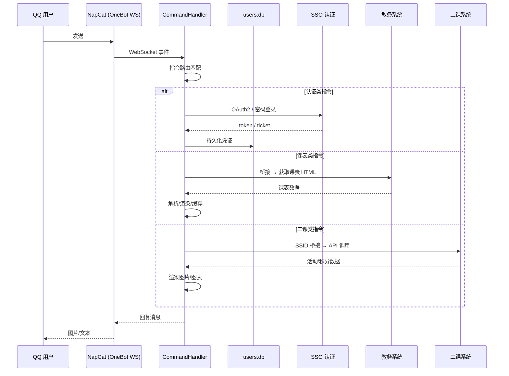
```mermaid
sequenceDiagram
    participant User as QQ 用户
    participant NB as NapCat (OneBot WS)
    participant Bot as CommandHandler
    participant DB as users.db
    participant SSO as SSO 认证
    participant JWGL as 教务系统
    participant SClass as 二课系统

    User->>NB: 发送 #指令
    NB->>Bot: WebSocket 事件
    Bot->>Bot: 指令路由匹配
    
    alt 认证类指令
        Bot->>SSO: OAuth2 / 密码登录
        SSO-->>Bot: token / ticket
        Bot->>DB: 持久化凭证
    else 课表类指令  
        Bot->>JWGL: 桥接 → 获取课表 HTML
        JWGL-->>Bot: 课表数据
        Bot->>Bot: 解析/渲染/缓存
    else 二课类指令
        Bot->>SClass: SSID 桥接 → API 调用
        SClass-->>Bot: 活动/积分数据
        Bot->>Bot: 渲染图片/图表
    end
    
    Bot-->>NB: 回复消息
    NB-->>User: 图片/文本
```

### 5.2 完整指令列表

| 指令 | 权限 | GUI版 | 无头版 | 数据源 | 行为 |
|------|------|-------|-------|--------|------|
| `#帮助` | 所有人 | ✅ | ✅ | 本地图片 | 发送预渲染的帮助指令列表图片 |
| `#登录` | 所有人 | ✅ | ✅ | SSH 实时API | 多步对话：学号→密码→验证码→SSO登录→自动更新课表+二课 |
| `#扫码登录` | 所有人 | ✅ | ✅ | SSH 实时API | 生成 OAuth2 二维码→用户扫码→轮询→获取 token→保存 |
| `#取消` | 所有人 | ✅ | ✅ | 会话管理 | 取消当前登录/报名/签到流程，清理会话状态 |
| `#刷新验证码` | 所有人 | ❌ | ✅ | SSH 实时API | 刷新当前流程的验证码图片（GUI版自动处理无需此指令） |
| `#更新` | 已绑定 | ✅ | ✅ | JWGL+二课 实时API | 验证 token → 静默更新课表JSON + 二课缓存 |
| `#更新调试` | **管理员** | ✅ | ✅ | JWGL 实时API | 尝试token更新课表→失败自动重登录→同时调试二课指令 |
| `#更新课表` | 已绑定 | ✅ | ✅ | JWGL 实时API | 拉取个人课表 JSON → 自动渲染本周课表图片 → 发送 |
| `#更新模板课表` | 所有人 | ✅ | ✅ | JWGL 实时API | 用 2403740 凭证在线拉取课表 → 保存 JSON+Excel → 合并 newjson → 发送 |
| `#导出课表` | 已绑定 | ✅ | ✅ | 本地JSON | 读取本地课表 JSON → `Schedule.save_excel()` → 发送 `.xlsx` |
| `#本周课表` | 已绑定 | ✅ | ✅ | 本地JSON | 加载本地课表 → 自动计算当前周 → 渲染周课表 PNG → 发送 |
| `#今日课表` | 已绑定 | ✅ | ✅ | 本地JSON | 渲染当日课表卡片图片 |
| `#明天课表` | 已绑定 | ✅ | ✅ | 本地JSON | 渲染次日课表卡片图片 |
| `#第N周课表` | 已绑定 | ✅ | ✅ | 本地JSON | 解析周次参数 → 渲染指定周课表图片 |
| `#密码更新` | 已绑定 | ✅ | ✅ | SSH 实时API | 用保存的学号+密码重新SSO登录→仅刷新 token/ticket |
| `#二课信息` | 已绑定 | ✅ | ✅ | 二课 实时API | 查询活动/签到/总结/社团/积分数据 → 文本摘要 + 信息图 |
| `#二课图表` | 已绑定 | ✅ | ✅ | SecondClassDB | 从 DB 缓存读取积分数据 → 渲染信息图表 PNG |
| `#二课列表` | **管理员** | ✅ | ✅ | MasterDB | 从 master 表读取活动 → 分页渲染列表图（每图最多10个）→ 合并转发 |
| `#查看二课` | **管理员** | ❌ | ✅ | MasterDB | 从 master 表读取所有活动 → 逐张渲染卡片 → 合并转发 |
| `#我的二课` | **管理员** | ✅ | ✅ | UserActivityDB | 读取未结束活动ID → 逐张渲染卡片 → 合并转发 |
| `#报名 <活动ID>` | 已绑定 | ❌ | ✅ | 二课 实时API | 获取 session → 解析报名页(s1/s2) → 验证码 → 提交报名 |
| `#签到 <活动ID>` | 已绑定 | ❌ | ✅ | 二课 实时API | 通过 signOnTV 端点提交签到（channelID=5） |
| `#签退 <活动ID>` | 已绑定 | ❌ | ✅ | 二课 实时API | 通过 signOnTV 端点提交签退（isSignOut=1） |
| `#预约报名 <活动ID>` | 已绑定 | ✅ | ✅ | 本地DB+二课API | 预约「报名未开始」活动 → 到点 @ 提醒（不自动报名） |
| `#我的预约` | 已绑定 | ✅ | ✅ | ReservationDB | 查询当前所有预约报名 |
| `#扫码签到` | 已绑定 | ✅ | ✅ | 二课 实时API | 等待用户发大屏二维码 → opencv 解码 → 解析 signOnTV URL → 提交签到/签退 |
| `#<活动ID>` | 已绑定 | ✅ | ✅ | DetailDB+二课API | 查询活动详情 → 从 DB 或实时 API → 渲染卡片图片 |
| `#查询用户` | **管理员** | ✅ | ✅ | accounts.json | 读取所有用户信息 → openpyxl 导出 Excel → 发送 |

### 5.3 指令依赖链

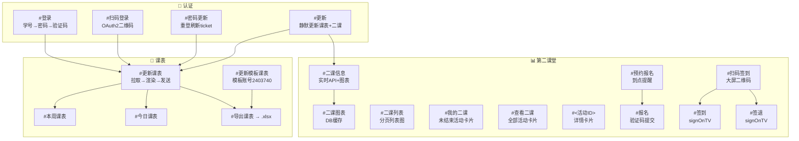
```mermaid
graph TB
    subgraph Auth["🔐 认证"]
        LOGIN["#登录<br/>学号→密码→验证码"]
        QRLOGIN["#扫码登录<br/>OAuth2二维码"]
        PWDUP["#密码更新<br/>重登刷新ticket"]
        UPDATE["#更新<br/>静默更新课表+二课"]
    end

    subgraph Schedule["📅 课表"]
        UPD_SCH["#更新课表<br/>拉取→渲染→发送"]
        TPL_SCH["#更新模板课表<br/>模板账号2403740"]
        WEEK["#本周课表"]
        TODAY["#今日课表"]
        EXPORT["#导出课表 → .xlsx"]
    end

    subgraph Second["📊 第二课堂"]
        ER_INFO["#二课信息<br/>实时API+图表"]
        ER_CHART["#二课图表<br/>DB缓存"]
        ER_LIST["#二课列表<br/>分页列表图"]
        MY_ER["#我的二课<br/>未结束活动卡片"]
        VIEW_ER["#查看二课<br/>全部活动卡片"]
        DETAIL["#&lt;活动ID&gt;<br/>详情卡片"]
        APPLY["#报名<br/>验证码提交"]
        SIGN_IN["#签到<br/>signOnTV"]
        SIGN_OUT["#签退<br/>signOnTV"]
        RESERVE["#预约报名<br/>到点提醒"]
        QR_SIGN["#扫码签到<br/>大屏二维码"]
    end

    LOGIN --> UPD_SCH
    QRLOGIN --> UPD_SCH
    PWDUP --> UPD_SCH
    UPD_SCH --> WEEK
    UPD_SCH --> TODAY
    UPD_SCH --> EXPORT
    TPL_SCH --> EXPORT
    UPDATE --> UPD_SCH
    UPDATE --> ER_INFO
    ER_INFO --> ER_CHART
    QR_SIGN --> SIGN_IN
    QR_SIGN --> SIGN_OUT
    RESERVE --> APPLY
```

### 5.4 数据源架构

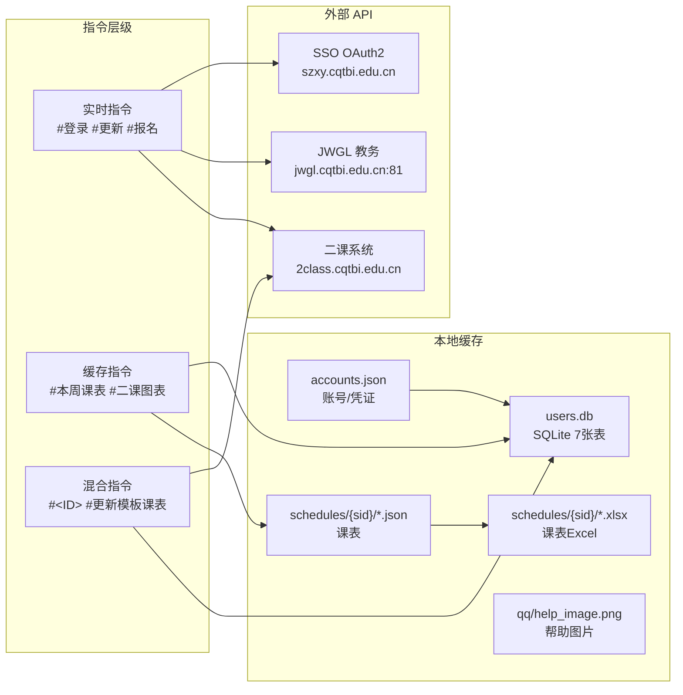
```mermaid
graph LR
    subgraph External["外部 API"]
        SSO_API["SSO OAuth2<br/>szxy.cqtbi.edu.cn"]
        JWGL_API["JWGL 教务<br/>jwgl.cqtbi.edu.cn:81"]
        CLASS_API["二课系统<br/>2class.cqtbi.edu.cn"]
    end

    subgraph Cache["本地缓存"]
        ACCOUNTS["accounts.json<br/>账号/凭证"]
        USERS_DB["users.db<br/>SQLite 7张表"]
        JSON_SCH["schedules/{sid}/*.json<br/>课表"]
        XLSX_SCH["schedules/{sid}/*.xlsx<br/>课表Excel"]
        HELP_IMG["qq/help_image.png<br/>帮助图片"]
    end

    subgraph Commands["指令层级"]
        REAL["实时指令<br/>#登录 #更新 #报名"]
        CACHE["缓存指令<br/>#本周课表 #二课图表"]
        HYBRID["混合指令<br/>#&lt;ID&gt; #更新模板课表"]
    end

    REAL --> SSO_API
    REAL --> JWGL_API
    REAL --> CLASS_API
    CACHE --> USERS_DB
    CACHE --> JSON_SCH
    HYBRID --> CLASS_API
    HYBRID --> USERS_DB
    ACCOUNTS --> USERS_DB
    JSON_SCH --> XLSX_SCH
```

### 5.5 核心工作流详解

#### #登录 工作流

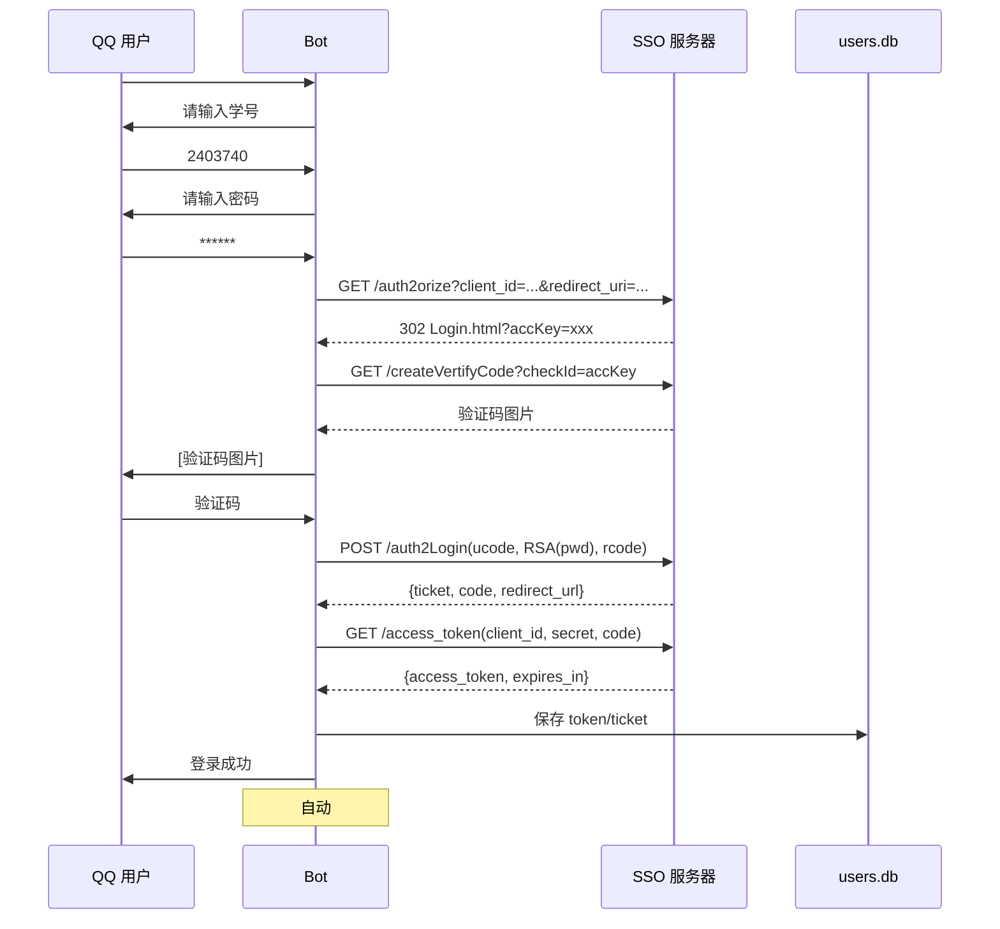
```mermaid
sequenceDiagram
    participant User as QQ 用户
    participant Bot as Bot
    participant SSO as SSO 服务器
    participant DB as users.db

    User->>Bot: #登录
    Bot->>User: 请输入学号
    User->>Bot: 2403740
    Bot->>User: 请输入密码
    User->>Bot: ******
    Bot->>SSO: GET /auth2orize?client_id=...&redirect_uri=...
    SSO-->>Bot: 302 Login.html?accKey=xxx
    Bot->>SSO: GET /createVertifyCode?checkId=accKey
    SSO-->>Bot: 验证码图片
    Bot->>User: [验证码图片]
    User->>Bot: 验证码
    Bot->>SSO: POST /auth2Login(ucode, RSA(pwd), rcode)
    SSO-->>Bot: {ticket, code, redirect_url}
    Bot->>SSO: GET /access_token(client_id, secret, code)
    SSO-->>Bot: {access_token, expires_in}
    Bot->>DB: 保存 token/ticket
    Bot->>User: 登录成功
    Note over Bot: 自动 #更新课表 + #二课信息
```

#### #报名 <活动ID> 工作流

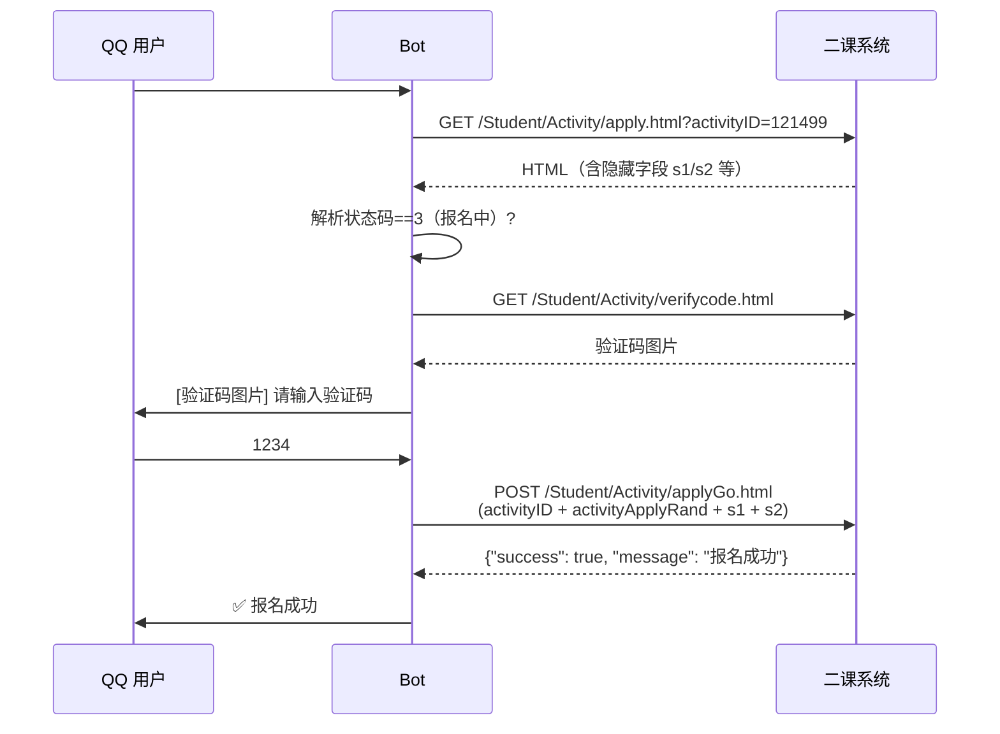
```mermaid
sequenceDiagram
    participant User as QQ 用户
    participant Bot as Bot
    participant SClass as 二课系统
    
    User->>Bot: #报名 121499
    Bot->>SClass: GET /Student/Activity/apply.html?activityID=121499
    SClass-->>Bot: HTML（含隐藏字段 s1/s2 等）
    Bot->>Bot: 解析状态码==3（报名中）?
    Bot->>SClass: GET /Student/Activity/verifycode.html
    SClass-->>Bot: 验证码图片
    Bot->>User: [验证码图片] 请输入验证码
    User->>Bot: 1234
    Bot->>SClass: POST /Student/Activity/applyGo.html<br/>(activityID + activityApplyRand + s1 + s2)
    SClass-->>Bot: {"success": true, "message": "报名成功"}
    Bot->>User: ✅ 报名成功
```

#### #更新模板课表 工作流

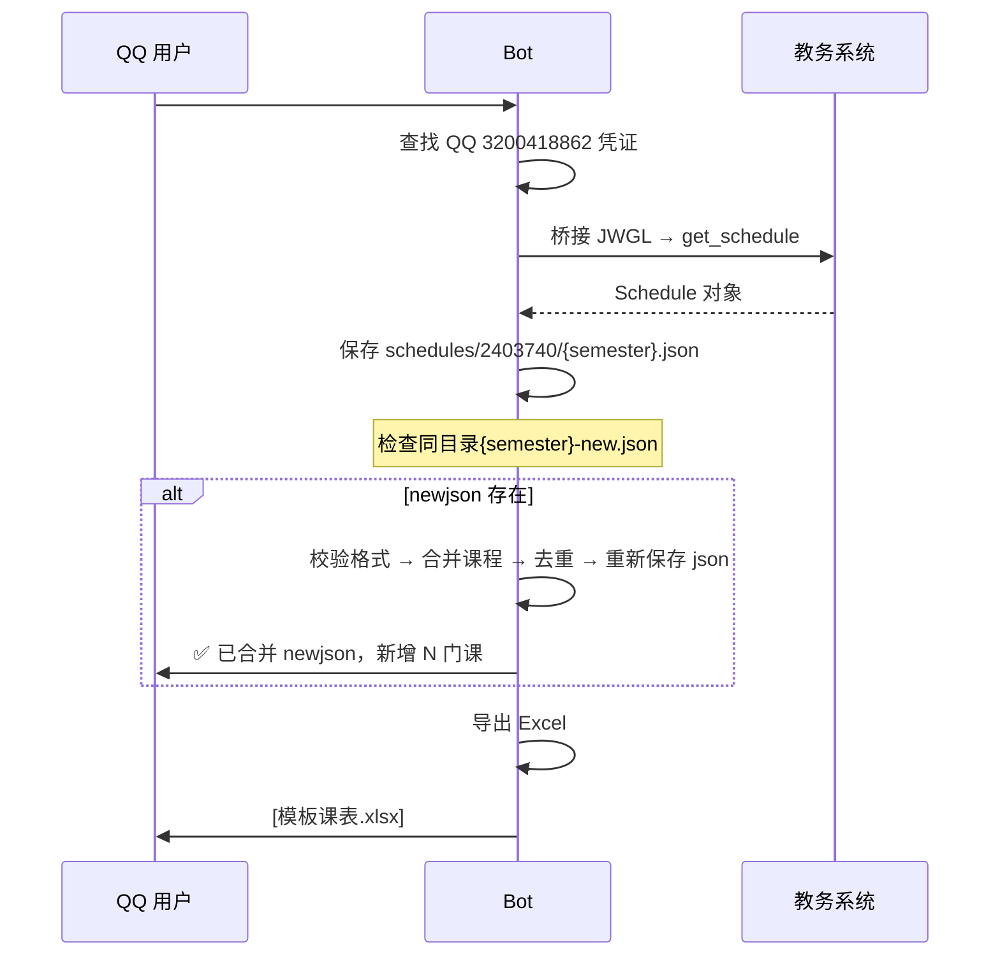
```mermaid
sequenceDiagram
    participant User as QQ 用户
    participant Bot as Bot
    participant JWGL as 教务系统
    
    User->>Bot: #更新模板课表
    Bot->>Bot: 查找 QQ 3200418862 凭证
    Bot->>JWGL: 桥接 JWGL → get_schedule
    JWGL-->>Bot: Schedule 对象
    Bot->>Bot: 保存 schedules/2403740/{semester}.json
    Note over Bot: 检查同目录{semester}-new.json
    alt newjson 存在
        Bot->>Bot: 校验格式 → 合并课程 → 去重 → 重新保存 json
        Bot->>User: ✅ 已合并 newjson，新增 N 门课
    end
    Bot->>Bot: 导出 Excel
    Bot->>User: [模板课表.xlsx]
```

#### #扫码签到 工作流

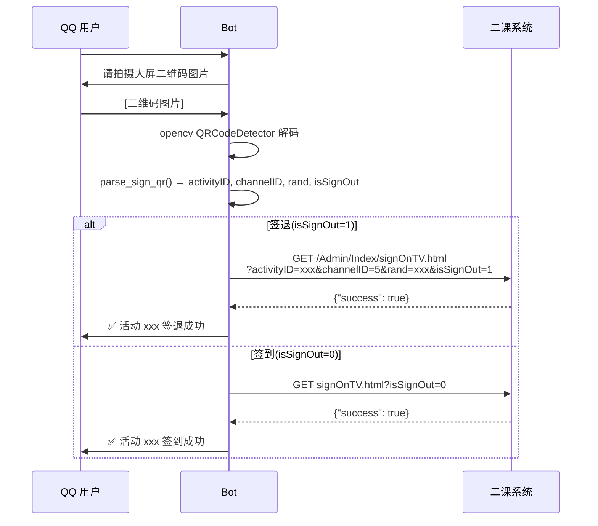
```mermaid
sequenceDiagram
    participant User as QQ 用户
    participant Bot as Bot
    participant SClass as 二课系统
    
    User->>Bot: #扫码签到
    Bot->>User: 请拍摄大屏二维码图片
    User->>Bot: [二维码图片]
    Bot->>Bot: opencv QRCodeDetector 解码
    Bot->>Bot: parse_sign_qr() → activityID, channelID, rand, isSignOut
    alt 签退(isSignOut=1)
        Bot->>SClass: GET /Admin/Index/signOnTV.html<br/>?activityID=xxx&channelID=5&rand=xxx&isSignOut=1
        SClass-->>Bot: {"success": true}
        Bot->>User: ✅ 活动 xxx 签退成功
    else 签到(isSignOut=0)
        Bot->>SClass: GET signOnTV.html?isSignOut=0
        SClass-->>Bot: {"success": true}
        Bot->>User: ✅ 活动 xxx 签到成功
    end
```

#### #预约报名 + #我的预约 工作流

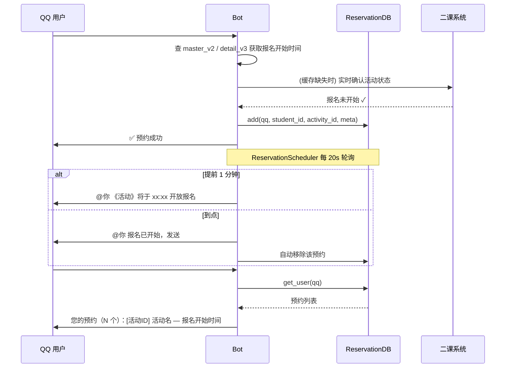
```mermaid
sequenceDiagram
    participant User as QQ 用户
    participant Bot as Bot
    participant DB as ReservationDB
    participant SClass as 二课系统
    
    User->>Bot: #预约报名 121582
    Bot->>Bot: 查 master_v2 / detail_v3 获取报名开始时间
    Bot->>SClass: (缓存缺失时) 实时确认活动状态
    SClass-->>Bot: 报名未开始 ✓
    Bot->>DB: add(qq, student_id, activity_id, meta)
    Bot->>User: ✅ 预约成功

    Note over Bot,DB: ReservationScheduler 每 20s 轮询

    alt 提前 1 分钟
        Bot->>User: @你 《活动》将于 xx:xx 开放报名
    else 到点
        Bot->>User: @你 报名已开始，发送 #报名 <ID>
        Bot->>DB: 自动移除该预约
    end

    User->>Bot: #我的预约
    Bot->>DB: get_user(qq)
    DB-->>Bot: 预约列表
    Bot->>User: 您的预约（N 个）：[活动ID] 活动名 — 报名开始时间
```

### 5.6 会话状态机

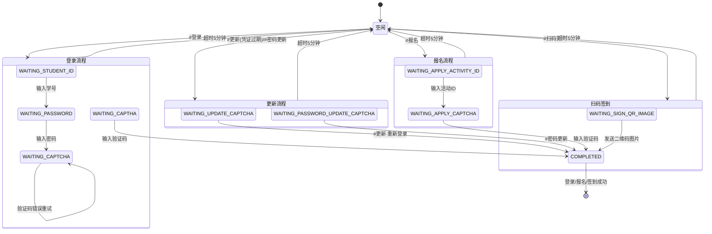
```mermaid
stateDiagram-v2
    [*] --> IDLE
    
    state "空闲" as IDLE
    state "登录流程" as LOGIN {
        WAITING_STUDENT_ID --> WAITING_PASSWORD: 输入学号
        WAITING_PASSWORD --> WAITING_CAPTCHA: 输入密码
        WAITING_CAPTHA --> COMPLETED: 输入验证码
        WAITING_CAPTCHA --> WAITING_CAPTCHA: 验证码错误重试
    }
    state "更新流程" as UPDATE_FLOW {
        WAITING_UPDATE_CAPTCHA --> COMPLETED: #更新 重新登录
        WAITING_PASSWORD_UPDATE_CAPTCHA --> COMPLETED: #密码更新
    }
    state "报名流程" as APPLY_FLOW {
        WAITING_APPLY_ACTIVITY_ID --> WAITING_APPLY_CAPTCHA: 输入活动ID
        WAITING_APPLY_CAPTCHA --> COMPLETED: 输入验证码
    }
    state "扫码签到" as QR_FLOW {
        WAITING_SIGN_QR_IMAGE --> COMPLETED: 发送二维码图片
    }

    IDLE --> LOGIN: #登录
    IDLE --> UPDATE_FLOW: #更新(凭证过期)/#密码更新
    IDLE --> APPLY_FLOW: #报名
    IDLE --> QR_FLOW: #扫码签到
    
    LOGIN --> IDLE: 超时5分钟
    UPDATE_FLOW --> IDLE: 超时5分钟
    APPLY_FLOW --> IDLE: 超时5分钟
    QR_FLOW --> IDLE: 超时5分钟
    COMPLETED --> [*]: 登录/报名/签到成功
```

> 会话 5 分钟无操作自动超时，后台线程每 60 秒清理超时会话。状态定义在 `core/user_session.py` 的 `SessionStep` 枚举中。

### 5.7 权限等级

| 权限 | 说明 | 判定方式 |
|------|------|---------|
| 所有人 | 无需绑定，直接响应 | 无条件响应 |
| 已绑定 | 需完成 SSO 登录绑定 | `accounts.json` 或 `users.db` 中存在该 QQ 记录 |
| 管理员 | 特殊权限，可执行管理类指令 | `forward_config.json` 中 `admin_qq` |

## 六、数据库表结构

### 6.1 数据库文件

`users.db` — SQLite 数据库，包含 7 张表。

### 6.2 `users` 表 — QQ ↔ SSO 账号绑定

| 字段 | 类型 | 默认值 | 说明 |
|------|------|--------|------|
| `qq` | INTEGER PK | — | QQ 号（主键） |
| `student_id` | TEXT NOT NULL | — | 学号 |
| `realname` | TEXT | `''` | 真实姓名 |
| `dept_id` | TEXT | `''` | 班级编号 |
| `dept_name` | TEXT | `''` | 班级名称 |
| `is_teacher` | INTEGER | `0` | 是否教师 |
| `access_token` | TEXT | `''` | OAuth2 访问令牌 |
| `portal_ticket` | TEXT | `''` | 门户票据 |
| `expires_at` | INTEGER | `0` | token 过期时间戳 |
| `last_login` | TEXT | `''` | 最后登录时间 |
| `created_at` | TEXT | `''` | 创建时间 |

### 6.3 `login_creds` 表 — 登录凭证

| 字段 | 类型 | 默认值 | 说明 |
|------|------|--------|------|
| `qq` | INTEGER PK | — | QQ 号 |
| `student_id` | TEXT NOT NULL | — | 学号 |
| `password` | TEXT | `''` | 密码 |
| `created_at` | TEXT | `''` | 创建时间 |

### 6.4 `second_class_v2` 表 — 二课积分快照

> 主键: `student_id`

| 字段 | 类型 | 默认值 | 说明 |
|------|------|--------|------|
| `student_id` | TEXT PK | — | 学号 |
| `qq` | INTEGER | `0` | QQ 号 |
| `realname` | TEXT | `''` | 姓名 |
| `deptname` | TEXT | `''` | 班级 |
| `college` | TEXT | `''` | 学院 |
| `major` | TEXT | `''` | 专业 |
| `total_score` | REAL | `0` | 总积分 |
| `activity_count` | INTEGER | `0` | 活动总数 |
| `unsigned_count` | INTEGER | `0` | 未签到 |
| `unfinished_count` | INTEGER | `0` | 未交总结 |
| `club_count` | INTEGER | `0` | 社团数 |
| `thought_score` | REAL | `0` | 思想成长（学期） |
| `skill_score` | REAL | `0` | 专业技能（学期） |
| `career_score` | REAL | `0` | 职业技能（学期） |
| `year_id` | TEXT | `''` | 学年 ID |
| `total_score_all` | REAL | `0` | 全学年总积分 |
| `thought_score_all` | REAL | `0` | 全学年思想成长 |
| `skill_score_all` | REAL | `0` | 全学年专业技能 |
| `career_score_all` | REAL | `0` | 全学年职业技能 |
| `ideology_score` | REAL | `0` | 思想政治（学期） |
| `labor_score` | REAL | `0` | 劳动教育（学期） |
| `art_score` | REAL | `0` | 文艺美育（学期） |
| `volunteer_score` | REAL | `0` | 志愿服务（学期） |
| `ideology_score_all` | REAL | `0` | 全学年思想政治 |
| `labor_score_all` | REAL | `0` | 全学年劳动教育 |
| `art_score_all` | REAL | `0` | 全学年文艺美育 |
| `volunteer_score_all` | REAL | `0` | 全学年志愿服务 |
| `total_duration` | REAL | `0` | 累计时长（学期） |
| `total_duration_all` | REAL | `0` | 累计时长（全学年） |
| `ideology_duration` | REAL | `0` | 思想政治时长（学期） |
| `labor_duration` | REAL | `0` | 劳动教育时长（学期） |
| `art_duration` | REAL | `0` | 文艺美育时长（学期） |
| `volunteer_duration` | REAL | `0` | 志愿服务时长（学期） |
| `ideology_duration_all` | REAL | `0` | 全学年思想政治时长 |
| `labor_duration_all` | REAL | `0` | 全学年劳动教育时长 |
| `art_duration_all` | REAL | `0` | 全学年文艺美育时长 |
| `volunteer_duration_all` | REAL | `0` | 全学年志愿服务时长 |
| `semester_info` | TEXT | `''` | 学期信息 |
| `updated_at` | TEXT | `''` | 更新时间 |

### 6.5 `second_class_master_v2` 表 — 活动总表

> 唯一索引: `(activity_id)` | 索引: `(student_id)`, `(fetched_at)`

| 字段 | 类型 | 默认值 | 说明 |
|------|------|--------|------|
| `id` | INTEGER PK AUTO | — | 自增主键 |
| `student_id` | TEXT NOT NULL | — | 学号 |
| `qq` | INTEGER | `0` | QQ 号 |
| `activity_id` | TEXT NOT NULL | — | 活动 ID（唯一键） |
| `activity_name` | TEXT | `''` | 活动名称 |
| `module_name` | TEXT | `''` | 模块名称 |
| `module_id` | TEXT | `''` | 模块 ID |
| `score` | REAL | `0` | 积分 |
| `organizer` | TEXT | `''` | 主办方 |
| `start_date` | TEXT | `''` | 活动开始时间 |
| `end_date` | TEXT | `''` | 活动结束时间 |
| `apply_start` | TEXT | `''` | 报名开始时间 |
| `apply_end` | TEXT | `''` | 报名结束时间 |
| `status_code` | TEXT | `''` | 状态码（0=草稿 … 7=已取消） |
| `status_name` | TEXT | `''` | 状态名称 |
| `check_after_apply` | TEXT | `''` | 报名后审核标志（0=否, 1=是, 2=抽签） |
| `limit_college` | TEXT | `''` | 限制学院 |
| `limit_grade` | TEXT | `''` | 限制年级 |
| `img` | TEXT | `''` | 活动图片文件名 |
| `is_closed` | TEXT | `'0'` | 是否关闭 |
| `fetched_at` | TEXT | `''` | 抓取时间 |

### 6.6 `second_class_user_activities` 表 — 用户未结束活动

> 唯一索引: `(student_id, activity_id)` | 索引: `(qq)`

| 字段 | 类型 | 默认值 | 说明 |
|------|------|--------|------|
| `id` | INTEGER PK AUTO | — | 自增主键 |
| `qq` | INTEGER | `0` | QQ 号 |
| `student_id` | TEXT NOT NULL | — | 学号 |
| `activity_id` | TEXT NOT NULL | — | 活动 ID |
| `fetched_at` | TEXT | `''` | 抓取时间 |
| `can_apply` | TEXT | `''` | 待报名标记（预留字段） |

**用途**：仅记录用户"未结束"活动（报名中+活动中+未开始），用于快速查询用户参与的未结束活动列表。通过调度器 `fetch_and_store_my_unfinished_activities()` 定时更新。

**数据流来源**：
- `GET /Student/My/myActivity.html` → 解析 tabs 1+2+5 的 `activity_id` → 清空旧记录 → 写入新数据

### 6.7 `second_class_activity_detail_v3` 表 — 活动详情

> 唯一索引: `(activity_id)` | 索引: `(fetched_at)`

| 字段 | 类型 | 默认值 | 说明 |
|------|------|--------|------|
| `id` | INTEGER PK AUTO | — | 自增主键 |
| `activity_id` | TEXT NOT NULL | — | 活动 ID（唯一键） |
| `activity_name` | TEXT | `''` | 活动名称 |
| `module_name` | TEXT | `''` | 类别名称 |
| `overview` | TEXT | `''` | 概述/实施内容与方式 |
| `location` | TEXT | `''` | 活动地点 |
| `duration` | TEXT | `''` | 发放时长 |
| `need_sign_out` | TEXT | `''` | 是否需要签退 |
| `need_summary` | TEXT | `''` | 是否需要提交总结 |
| `apply_time` | TEXT | `''` | 报名时间范围 |
| `activity_time` | TEXT | `''` | 活动时间范围 |
| `fetched_at` | TEXT | `''` | 抓取时间 |

### 6.8 `second_class_users` 表 — 二课用户活动与预约

> 主键: `(qq)` | 唯一索引: `(student_id)`

由 `SecondClassUserActivityDB` 创建/维护，`ReservationDB` 读写 `reserved_*` 两列。

| 字段 | 类型 | 默认值 | 说明 |
|------|------|--------|------|
| `qq` | INTEGER PK | — | QQ 号（主键） |
| `student_id` | TEXT NOT NULL UNIQUE | — | 学号 |
| `unfinished_activity_ids` | TEXT | `''` | 逗号分隔的未结束活动ID（报名中+活动中+未开始） |
| `reserved_activity_ids` | TEXT | `''` | **预约报名**的逗号分隔活动ID |
| `reservations_meta` | TEXT | `'{}'` | **预约报名**元数据 JSON：`{activity_id: {name, apply_start, notified, ...}}` |
| `updated_at` | TEXT | `''` | 更新时间 |

---


## 七、SSO 登录关键参数

### 7.1 OAuth2 授权码流程

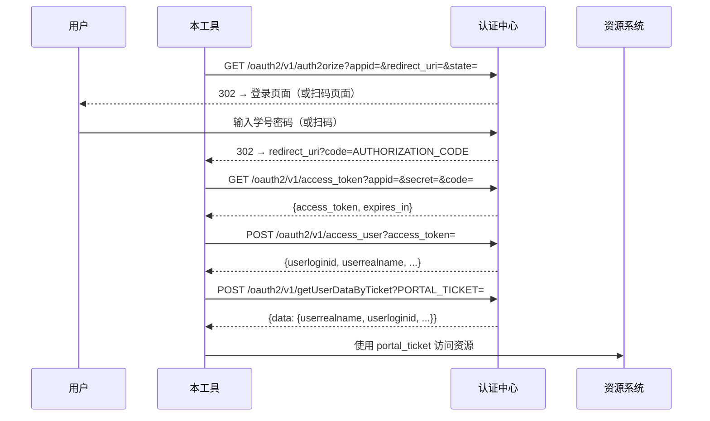
```mermaid
sequenceDiagram
    participant User as 用户
    participant App as 本工具
    participant SSO as 认证中心
    participant Resource as 资源系统

    App->>SSO: GET /oauth2/v1/auth2orize?appid=&redirect_uri=&state=
    SSO-->>User: 302 → 登录页面（或扫码页面）
    User->>SSO: 输入学号密码（或扫码）
    SSO-->>App: 302 → redirect_uri?code=AUTHORIZATION_CODE
    App->>SSO: GET /oauth2/v1/access_token?appid=&secret=&code=
    SSO-->>App: {access_token, expires_in}
    App->>SSO: POST /oauth2/v1/access_user?access_token=
    SSO-->>App: {userloginid, userrealname, ...}
    App->>SSO: POST /oauth2/v1/getUserDataByTicket?PORTAL_TICKET=
    SSO-->>App: {data: {userrealname, userloginid, ...}}
    App->>Resource: 使用 portal_ticket 访问资源
```

### 7.2 凭证生命周期

| 参数 | 来源 | 生命周期 | 用途 |
|------|------|---------|------|
| `code` | 授权回调 | 一次性（5分钟有效） | 换取 access_token |
| `access_token` | code 换取 | 1 小时（`expires_in=3600`） | 获取用户信息、桥接二课 |
| `portal_ticket` | access_token 换取 | 长期（登录会话期内） | 访问门户各系统 |
| `SSID` | 二课桥接 | 未知（可能周期性过期） | 二课 API 会话 |

### 7.3 二课桥接流程

```
access_token (OAuth2 令牌)
    ↓ GET /v1/auth2orize (自动授权)
portal_ticket (门户票据)
    ↓ POST /cqdddt/dtLog!log.action (门户登录)
    ↓ GET /Admin/Index/cqtbiSSO?PORTAL_TICKET=xxx (二课桥接)
SSID cookie (二课会话)
```

> **注意**: 桥接必须使用安卓 UA，桌面 UA 虽返回 200 但 SSID 不可用。

### 7.4 SSO 关键常量

| 参数 | 值 |
|------|-----|
| appid | `sso20240408001` |
| secret | `002658359667427995860705420291461` |
| 认证端点 | `http://szxy.cqtbi.edu.cn/oauth2/v1/auth2orize` |
| token 端点 | `http://szxy.cqtbi.edu.cn/oauth2/v1/access_token` |
| 用户信息端点 | `http://szxy.cqtbi.edu.cn/oauth2/v1/access_user` |
| 票据验证端点 | `http://szxy.cqtbi.edu.cn/oauth2/v1/getUserDataByTicket` |
| 注销端点 | `http://szxy.cqtbi.edu.cn/oauth2/v1/auth2LoginOut` |

### 7.5 凭证转换链与存储

#### 完整转换链

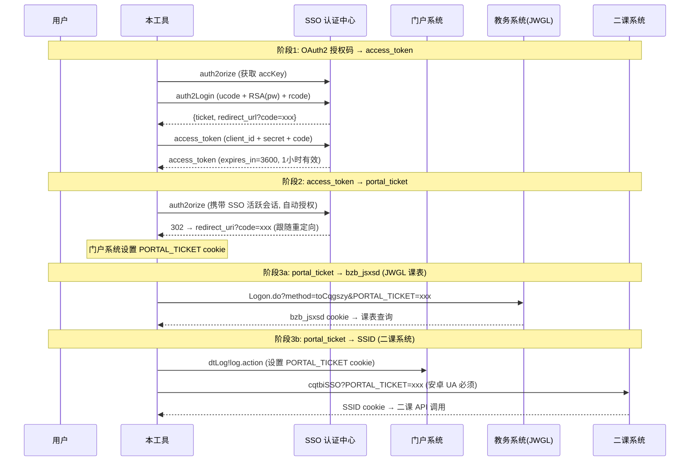
```mermaid
sequenceDiagram
    participant User as 用户
    participant App as 本工具
    participant SSO as SSO 认证中心
    participant Portal as 门户系统
    participant JWGL as 教务系统(JWGL)
    participant SClass as 二课系统

    Note over User,SClass: 阶段1: OAuth2 授权码 → access_token
    App->>SSO: auth2orize (获取 accKey)
    App->>SSO: auth2Login (ucode + RSA(pw) + rcode)
    SSO-->>App: {ticket, redirect_url?code=xxx}
    App->>SSO: access_token (client_id + secret + code)
    SSO-->>App: access_token (expires_in=3600, 1小时有效)

    Note over User,SClass: 阶段2: access_token → portal_ticket
    App->>SSO: auth2orize (携带 SSO 活跃会话, 自动授权)
    SSO-->>App: 302 → redirect_uri?code=xxx (跟随重定向)
    Note over App: 门户系统设置 PORTAL_TICKET cookie

    Note over User,SClass: 阶段3a: portal_ticket → bzb_jsxsd (JWGL 课表)
    App->>JWGL: Logon.do?method=toCqgszy&PORTAL_TICKET=xxx
    JWGL-->>App: bzb_jsxsd cookie → 课表查询

    Note over User,SClass: 阶段3b: portal_ticket → SSID (二课系统)
    App->>Portal: dtLog!log.action (设置 PORTAL_TICKET cookie)
    App->>SClass: cqtbiSSO?PORTAL_TICKET=xxx (安卓 UA 必须)
    SClass-->>App: SSID cookie → 二课 API 调用
```

#### 凭证存储位置

| 凭证 | 存储位置 | 持久化 | 代码来源 |
|------|---------|--------|---------|
| `code` | **不存储**（一次性） | ❌ | `sso/sso_common.py` 自动处理 |
| `access_token` | `accounts.json.accounts[].access_token` | ✅ 文件 | `sso/sso_common.py` → `save_data()` |
| `access_token` | `users.db.users.access_token` | ✅ SQLite | `core/account_store.py` |
| `portal_ticket` | `accounts.json.accounts[].portal_ticket` | ✅ 文件 | `sso/sso_common.py` → `save_data()` |
| `portal_ticket` | `users.db.users.portal_ticket` | ✅ SQLite | `core/account_store.py` |
| `expires_at` | `accounts.json.accounts[].expires_at` | ✅ 文件 | 由 `expires_in` 换算 |
| `bzb_jsxsd` | **仅 HTTP Session.cookies** | ❌ 内存 | `schedule/jwgl_client.py` → `bridge()` |
| `SSID` | **仅内存缓存** `_SSID_CACHE`（key=`student_id`） | ❌ 内存 | `secondclass/secondclass_tool.py` 第736行 |

> SSID 和 bzb_jsxsd 不持久化到磁盘，进程重启后需要重新桥接获取。

#### 函数映射表

| 转换方向 | 函数 | 所在文件 |
|---------|------|---------|
| `code` → `access_token` | `exchange_code_for_token(code)` | `sso/sso_common.py` |
| `access_token` → `portal_ticket` | `get_portal_ticket(session, access_token)` | `sso/sso_common.py` |
| `access_token` → `portal_ticket` | `obtain_portal_ticket(access_token)` | `secondclass/secondclass_tool.py` |
| `portal_ticket` → `bzb_jsxsd` | `JWGLClient.bridge()` | `schedule/jwgl_client.py` |
| `portal_ticket` → `SSID` | `obtain_secondclass_session_from_user(user)` | `secondclass/secondclass_tool.py` |
| `token+ticket` → `SSID` | `convert_to_ssid(access_token, portal_ticket, *, student_id)` | `secondclass/secondclass_tool.py` |
| SSID 缓存 | `_cache_ssid(student_id, sess)` → `_SSID_CACHE[student_id]` | `secondclass/secondclass_tool.py` |
| SSID 复用 | `_get_cached_session(student_id)` → 验证有效性 → 返回会话 | `secondclass/secondclass_tool.py` |

#### 凭证层级图

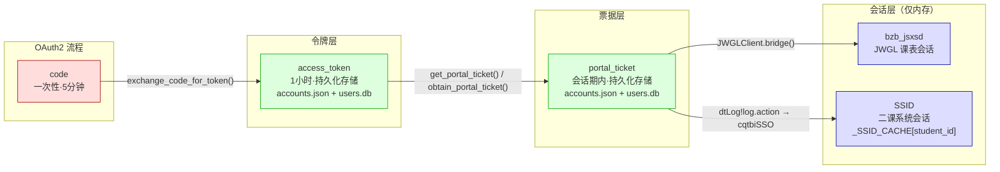
```mermaid
flowchart LR
    subgraph OAuth["OAuth2 流程"]
        A["code<br/>一次性·5分钟"]
    end
    subgraph Token["令牌层"]
        B["access_token<br/>1小时·持久化存储<br/>accounts.json + users.db"]
    end
    subgraph Ticket["票据层"]
        C["portal_ticket<br/>会话期内·持久化存储<br/>accounts.json + users.db"]
    end
    subgraph Session["会话层（仅内存）"]
        D["bzb_jsxsd<br/>JWGL 课表会话"]
        E["SSID<br/>二课系统会话<br/>_SSID_CACHE[student_id]"]
    end

    A -->|"exchange_code_for_token()"| B
    B -->|"get_portal_ticket() / obtain_portal_ticket()"| C
    C -->|"JWGLClient.bridge()"| D
    C -->|"dtLog!log.action → cqtbiSSO"| E

    style A fill:#fdd,stroke:#a00
    style B fill:#dfd,stroke:#0a0
    style C fill:#dfd,stroke:#0a0
    style D fill:#ddf,stroke:#00a
    style E fill:#ddf,stroke:#00a
```

#### 典型转换流程（以 `convert_to_ssid()` 为例）

```python
# 1. 优先尝试缓存 SSID
ssid = _get_cached_session(student_id)
if ssid: return ssid

# 2. 用 portal_ticket 直接桥接
sess = try_auth(portal_ticket)  # dtLog!log.action → cqtbiSSO
if sess: return sess

# 3. portal_ticket 过期 → 用 access_token 刷新
new_pt = obtain_portal_ticket(access_token)  # auth2orize 自动授权
sess = try_auth(new_pt)
if sess: return sess

# 4. 全部失败 → 报错
raise SecondClassAuthError("登录已过期，请重新登录")
```

---

## 八、配置文件结构

### 8.1 `accounts.json`

```json
{
  "appid": "sso20240408001",
  "secret": "002658359667427995860705420291461",
  "accounts": [
    {
      "qq": 3200418862,
      "student_id": "2403740",
      "password": "xxxxxx",
      "access_token": "8c43dce77fc143dd82b49de159d91943",
      "expires_at": 0,
      "portal_ticket": "xxxxxxxxxxx",
      "last_login": "2026-06-04T18:47:38"
    }
  ]
}
```

| 字段 | 类型 | 说明 |
|------|------|------|
| `appid` | TEXT | OAuth2 应用 ID |
| `secret` | TEXT | OAuth2 密钥 |
| `accounts[]` | ARRAY | 用户列表 |
| `accounts[].qq` | INTEGER | QQ 号 |
| `accounts[].student_id` | TEXT | 学号 |
| `accounts[].password` | TEXT | 密码（明文） |
| `accounts[].access_token` | TEXT | OAuth2 令牌 |
| `accounts[].expires_at` | INTEGER | token 过期时间戳 |
| `accounts[].portal_ticket` | TEXT | 门户票据 |
| `accounts[].last_login` | TEXT | 最后登录时间 |

### 8.2 `forward_config.json`

```json
{
  "ws_url": "ws://127.0.0.1:3001",
  "access_token": "MefIYHhc~qWqWTfR",
  "source_groups": [264092896],
  "target_groups": [307548801],
  "admin_qq": 3200418862,
  "command_enabled": true
}
```

| 字段 | 类型 | 说明 |
|------|------|------|
| `ws_url` | TEXT | NapCat WebSocket 地址 |
| `access_token` | TEXT | WS 认证令牌 |
| `source_groups` | ARRAY | 源群号列表（监听消息来源） |
| `target_groups` | ARRAY | 目标群号列表（转发目标） |
| `admin_qq` | INTEGER | 管理员 QQ 号 |
| `command_enabled` | BOOL | 是否启用 #指令系统 |

### 8.3 `schedules/semester_config.json`

```json
{
  "2025-2026-2": {
    "start_date": "2026-03-02",
    "total_weeks": 20
  }
}
```

### 8.4 配置优先级

```
accounts.json ← 读写: sso/sso_common.py, core/account_store.py
     ↓ 同步
users.db.users 表 ← 读写: qq/monitor_forward.py
     ↓
users.db.login_creds 表 ← 写入: qq/monitor_forward.py (#登录)
```

---

## 九、三端数据流全景

### 9.1 概述

本项目三个核心工具——**QQ 转发工具**、**二课调度工具**、**课表工具**——通过共享的凭证存储和数据库实现数据互通。QQ 转发工具是所有用户指令的入口，二课调度工具是数据采集的后台进程，课表工具提供教务系统课表数据。


```mermaid
graph TB
    subgraph User["用户入口"]
        QQ_CMD["QQ 群 #指令<br/>qq/monitor_forward.py<br/>qq/qq_forward.py"]
    end

    subgraph Storage["共享存储层"]
        ACCT["accounts.json<br/>账号/凭证<br/>core/account_store.py 读写"]
        DB["users.db<br/>7张SQLite表<br/>secondclass_tool.py 路径"]
        SCHED_DIR["schedules/{sid}/<br/>课表JSON/Excel/PNG"]
    end

    subgraph ScheduleMod["课表工具"]
        SCH_CLI["schedule/jwgl_client.py<br/>JWGL HTTP客户端"]
        SCH_TOOL["schedule/schedule_tool.py<br/>课表GUI + 导入导出"]
        SCH_IMG["schedule/schedule_image.py<br/>课表图片渲染"]
    end

    subgraph SCMod["二课核心"]
        SC_TOOL["secondclass/secondclass_tool.py<br/>SSID管理/积分/活动/详情"]
        SC_IMG["secondclass/secondclass_image.py<br/>二课信息图"]
        SC_CHART["secondclass/secondclass_activity_chart.py<br/>活动卡片/列表"]
    end

    subgraph Scheduler["二课调度工具"]
        SCHED["secondclass/secondclass_scheduler.py<br/>定时后台拉取"]
        SCHED_GUI["secondclass/secondclass_tool_gui.py<br/>调度管理GUI"]
    end

    subgraph Auth["认证层"]
        SSO["sso/sso_common.py<br/>SSO登录常量+函数"]
        SESSION["core/user_session.py<br/>多步会话管理"]
        ONE_BOT["core/onebot_client.py<br/>OneBot v11 WS客户端"]
        CMD_UTILS["core/command_utils.py<br/>消息回复公共方法"]
    end

    QQ_CMD -->|"find_account_by_qq()"| ACCT
    QQ_CMD -->|"JWGLClient 实例化"| SCH_CLI
    QQ_CMD -->|"secondclass_tool 函数调用"| SC_TOOL
    QQ_CMD -->|"读取缓存"| DB
    QQ_CMD -->|"读取课表"| SCHED_DIR

    SCH_CLI -->|"load_data()/save_data()"| ACCT
    SCH_CLI -->|"保存课表"| SCHED_DIR

    SCH_TOOL -->|"load_data()"| ACCT
    SCH_TOOL -->|"保存/读取课表"| SCHED_DIR

    SCH_IMG -->|"读取课表JSON"| SCHED_DIR

    SCHED -->|"get_all_user_credentials()"| ACCT
    SCHED -->|"get_all_user_credentials()"| DB
    SCHED -->|"fetch_and_store_master_data()"| SC_TOOL
    SCHED -->|"写入"| DB

    SC_TOOL -->|"读凭证"| ACCT
    SC_TOOL -->|"读写积分/活动"| DB
    SC_IMG -->|"读积分快照"| DB
    SC_CHART -->|"读活动/详情"| DB

    QQ_CMD --> SSO
    SCH_CLI --> SSO
    SC_TOOL --> SSO
```

### 9.2 核心数据流总览

| 数据流 | 发起者 → 调用目标 | 数据源 | 数据去向 |
|--------|------------------|--------|---------|
| **用户登录** | QQ指令 → `JWGLClient.sso_login()` | 用户输入 | `accounts.json` + `users.db.users` |
| **课表获取** | QQ指令 → `JWGLClient.get_schedule()` | JWGL 教务系统 API | `schedules/{sid}/{semester}.json` |
| **课表缓存读取** | QQ指令 → `schedule.io._load_schedule_from_json()` | `schedules/{sid}/{semester}.json` | 图片渲染/Excel导出 |
| **二课积分** | QQ指令 → `fetch_and_save_secondclass_info()` | 二课系统 API | `users.db.second_class_v2` |
| **二课活动总表** | 二课调度器 → `fetch_and_store_master_data()` | 二课系统 API | `users.db.second_class_master_v2` |
| **二课活动详情** | 二课调度器 / QQ指令 → `fetch_activity_detail_page()` | 二课系统 API | `users.db.second_class_activity_detail_v3` |
| **用户未结束活动** | 二课调度器 → `fetch_and_store_my_unfinished_activities()` | 二课系统 API | `users.db.second_class_user_activities` |
| **活动报名** | QQ指令 → `fetch_apply_page()` + `submit_activity_apply()` | 二课系统 API | 直接提交（不入缓存） |
| **签到/签退** | QQ指令 → `submit_sign()` | 二课系统 API | 直接提交（不入缓存） |

### 9.3 共享数据源详解

#### 9.3.1 `accounts.json` — 凭证权威来源

| 属性 | 说明 |
|------|------|
| 路径 | `d:\code\private\class\accounts.json` |
| 常量定义 | `sso/sso_common.py:DATA_FILE` |
| 读写函数 | `sso_common.load_data()` / `save_data()` — 各模块统一调用 |
| 统一读写层 | `core/account_store.py` — `find_account_by_qq()`, `save_account()`, `ensure_account()` |

**使用者矩阵**：

| 使用者 | 读 | 写 | 入口函数 |
|--------|:--:|:--:|---------|
| QQ 转发 `monitor_forward.py` | ✅ | ✅ | `find_account_by_qq()` |
| QQ 转发 `qq_forward.py` | ✅ | ✅ | `UserDB` + `find_account_by_qq()` |
| 课表 GUI `schedule_tool.py` | ✅ | ✅ | `App.__init__()` 直接调 `load_data()` |
| 二课调度 `secondclass_scheduler.py` | ✅ | ❌ | 间接通过 `get_all_user_credentials()` |
| 二课核心 `secondclass_tool.py` | ✅ | ❌ | `get_all_user_credentials()` |

#### 9.3.2 `users.db` — SQLite 共享数据库

| 属性 | 说明 |
|------|------|
| 路径 | `d:\code\private\class\users.db` |
| 常量定义 | `secondclass/secondclass_tool.py:USER_DB_FILE` |
| 持有者 | `secondclass/secondclass_tool.py`（SQLite 连接管理） |

**跨模块读写映射**：

| 表名 | 主键 | 写入者 | 读取者 |
|------|------|--------|--------|
| `users` | `qq` | `qq/qq_forward.py:UserDB`、`qq/monitor_forward.py` | `secondclass/secondclass_tool.py`、`monitor_forward.py`、`qq_forward.py` |
| `login_creds` | `qq` | `qq/monitor_forward.py`（#登录保存密码） | `qq/monitor_forward.py`（#更新自动重登） |
| `second_class_v2` | `student_id` | `SecondClassDB.upsert()`（由 `fetch_and_save_secondclass_info()` 调用） | `SecondClassDB.get_by_qq/get_by_student_id()` |
| `second_class_master_v2` | `(student_id, activity_id)` | `SecondClassMasterDB.upsert_activities()`（由 `fetch_and_store_master_data()` 调用） | `SecondClassMasterDB.get_by_student_id()` |
| `second_class_activity_detail_v3` | `activity_id` | `SecondClassActivityDetailDB.upsert()` | `SecondClassActivityDetailDB.get_by_activity_id()` |
| `second_class_user_activities` | `(student_id, activity_id)` | `fetch_and_store_my_unfinished_activities()` | `SecondClassUserActivityDB.get_activity_ids_by_student_id()` |

#### 9.3.3 `schedules/{student_id}/` — 课表文件目录

| 属性 | 说明 |
|------|------|
| 格式 | `schedules/{学号}/{学期}.json` / `.xlsx` / `secondclass.png` / `_activity_charts/` |
| 写入者 | `schedule/jwgl_client.py:JWGLClient.get_schedule()` → `Schedule.save_json()`、QQ 转发指令 |
| 读取者 | `schedule.io._load_schedule_from_json()`、`schedule.schedule_image`（渲染图片） |

### 9.4 跨模块函数调用链

#### 9.4.1 QQ 转发 → 课表模块（`schedule/`）

所有 SSO 登录相关的 #指令（`#登录`、`#扫码登录`、`#更新课表`、`#密码更新`、`#更新模板课表`、`#更新`）均实例化 `JWGLClient` 并调用其方法：

```python
# qq/monitor_forward.py 中典型调用链
from schedule.jwgl_client import JWGLClient

# #登录 指令
client = JWGLClient()
client.begin_sso()             # 获取 accKey + 验证码
client.sso_login(ucode, pwd, rcode)   # 学号密码登录
client.portal_login(ticket)    # 门户登录
client.bridge()                # JWGL 桥接 → bzb_jsxsd cookie
schedule = client.get_schedule(semester, week, sid, name)  # 获取课表
schedule.save_json(path)       # 保存到 schedules/{sid}/{sem}.json
```

课表缓存读取指令（`#本周课表`、`#今日课表`、`#明天课表`、`#第N周课表`）使用 `schedule/io.py` 和 `schedule/schedule_image.py`：

```python
# 典型调用链
from schedule.io import _schedule_path, _load_schedule_from_json
from schedule.schedule_image import render_day_image

path = _schedule_path(student_id, semester)        # 构建文件路径
schedule = _load_schedule_from_json(path)           # 读取本地JSON
img_path = render_day_image(schedule, ...)          # 渲染图片
```

#### 9.4.2 QQ 转发 → 二课核心（`secondclass/`）

二课相关 #指令直接调用 `secondclass/secondclass_tool.py` 的函数：

```python
# qq/monitor_forward.py 或 qq/qq_forward.py 中
from secondclass import secondclass_tool as sct

# #二课信息 指令
sess = sct.obtain_secondclass_session_from_user(user)   # 获取SSID会话
data = sct.fetch_all_with_session(sess)                  # 抓取积分数据
sct.SecondClassDB.upsert(qq, **data)                     # 写入 DB
from secondclass.secondclass_image import render_secondclass_chart
render_secondclass_chart(student_id, data)               # 渲染信息图

# #报名 <ID> 指令
sess = sct.obtain_secondclass_session_from_user(user)
page_data = sct.fetch_apply_page(sess, activity_id)      # 获取报名页(s1/s2)
captcha = ...                                             # 验证码处理
result = sct.submit_activity_apply(sess, activity_id, captcha, s1, s2)

# #<活动ID> 指令
detail = sct.SecondClassActivityDetailDB.get_by_activity_id(aid)
if not detail:
    sct.fetch_and_save_activity_detail(sess, aid)        # 实时拉取
    detail = sct.SecondClassActivityDetailDB.get_by_activity_id(aid)
from secondclass.secondclass_activity_chart import render_activity_card
render_activity_card(detail)                              # 渲染卡片图片
```

#### 9.4.3 二课调度器 → 二课核心

```python
# secondclass/secondclass_scheduler.py 中
from secondclass import secondclass_tool as sct

def run_once(self):
    users = sct.get_all_user_credentials()  # 读取 accounts.json + users.db
    for user in users:
        sess = sct.obtain_secondclass_session_from_user(user)
        sct.fetch_and_store_master_data(
            sess, user.student_id, user.qq,
            fetch_details=True, max_detail_activities=10,
            include_reparse=True, scan_new=True, scan_range=50
        )
        sct.fetch_and_store_my_unfinished_activities(
            sess, user.student_id, user.qq
        )
```

#### 9.4.4 凭证共享链

```
code (一次性, 5分钟)
  ↓ exchange_code_for_token() [sso/sso_common.py]
access_token (1小时, 持久化: accounts.json + users.db.users)
  ↓ get_portal_ticket() / obtain_portal_ticket() [sso_common.py / secondclass_tool.py]
portal_ticket (会话期内, 持久化: accounts.json + users.db.users)
  ├─ JWGLClient.bridge() → bzb_jsxsd (仅内存, 课表会话)
  └─ dtLog!log.action → cqtbiSSO → SSID (仅内存, _SSID_CACHE)
```

| 凭证 | accounts.json | users.db.users | 内存 |
|------|:---:|:---:|:---:|
| `access_token` | `accounts[].access_token` | `users.access_token` | — |
| `portal_ticket` | `accounts[].portal_ticket` | `users.portal_ticket` | — |
| `bzb_jsxsd` | — | — | `requests.Session.cookies` (JWGLClient) |
| `SSID` | — | — | `_SSID_CACHE[student_id]` (secondclass_tool 模块级) |

**凭证优先级**：`get_all_user_credentials()` 先读 `users.db.users` 表，再读 `accounts.json`，同 `student_id` 时 `accounts.json` 覆盖 users 表。

### 9.5 依赖关系总结

```
┌──────────────────────────────────────────────────────────────────┐
│                       accounts.json                               │
│           core/account_store.py 统一读写接口                      │
│   字段: qq, student_id, password, access_token, portal_ticket     │
└────┬──────────┬──────────────┬────────────────┬──────────────────┘
     │          │              │                │
     ▼          ▼              ▼                ▼
┌──────────┐ ┌──────────┐ ┌──────────┐ ┌──────────────┐
│QQ转发工具 │ │二课调度器 │ │课表GUI   │ │二课核心      │
│monitor/   │ │scheduler │ │schedule  │ │secondclass   │
│qq_forward │ │(只读)    │ │_tool.py  │ │_tool.py      │
│(读+写)    │ │          │ │(读+写)   │ │(只读)        │
└────┬──────┘ └────┬─────┘ └────┬─────┘ └──────┬───────┘
     │             │            │               │
     │             ▼            │               │
     │    ┌──────────────────────────────────────────────┐
     │    │                   users.db                    │
     │    │   7张SQLite表 (secondclass_tool.py 路径)      │
     │    │   users, login_creds, second_class_v2,        │
     │    │   second_class_master_v2, detail_v3,          │
     │    │   second_class_user_activities, reservations  │
     │    └──────────────────────────────────────────────┘
     │                         ▲
     │                         │
     ▼                         │
┌──────────────────────────────────────────────────────┐
│             schedules/{student_id}/                   │
│   课表JSON/Excel (写:QQ指令+课表GUI, 读:课表图片渲染) │
│   二课PNG (写:QQ指令#二课信息, 读:QQ指令#二课图表)     │
│   活动卡片 (写:#<活动ID>/#查看二课, 读:合并转发)        │
└──────────────────────────────────────────────────────┘
```

### 9.6 关键设计要点

1. **`users.db` 是核心共享数据库**：由 `secondclass/secondclass_tool.py` 中的 `USER_DB_FILE` 常量定义路径，所有模块（二课、QQ、预约）共用同一个 SQLite 文件。各 `*DB` 类内部使用线程锁保证并发安全。

2. **`accounts.json` 是凭证权威来源**：`get_all_user_credentials()` 先读 `users.db.users` 表，再读 `accounts.json`，同 `student_id` 时 `accounts.json` 覆盖 users 表（后者存有更新的 token/ticket）。

3. **SSID 和 bzb_jsxsd 不持久化**：这两个会话 cookie 只在内存中（`_SSID_CACHE` 和 `requests.Session.cookies`），进程重启后需重新通过 `portal_ticket` 桥接获取。

4. **QQ 模块是课表和二课的"用户入口"**：所有 #指令 都通过 `core/account_store.find_account_by_qq()` 从 `accounts.json` 获取凭证，然后调用 `schedule/jwgl_client.py` 或 `secondclass/secondclass_tool.py` 的函数。QQ 模块本身不实现业务逻辑，只做路由和编排。

5. **二课调度器是"独立运行的后台进程"**：它不依赖 QQ 模块，独立从 `accounts.json` + `users.db` 读取凭证，定时拉取数据写入 `users.db` 的二课相关表，供 QQ 模块的 `#二课图表`、`#查看二课`、`#我的二课` 等指令读取缓存。

6. **凭证共享层**：`core/account_store.py` 是所有模块统一的 `accounts.json` 读写入口；`sso/sso_common.py` 提供所有 SSO 认证函数。两个 QQ 版本（`monitor_forward.py` 和 `qq_forward.py`）共享 `core/onebot_client.py` 和 `core/command_utils.py`。

---

## 十、二课系统 API 接口

### 10.1 认证

**桥接登录（获取 SSID）**

```
GET https://2class.cqtbi.edu.cn/Admin/Index/cqtbiSSO?PORTAL_TICKET={ticket}
```

| 项 | 值 |
|----|-----|
| 方法 | GET |
| 参数 | `PORTAL_TICKET` — 门户票据 |
| 必要 Header | `User-Agent: Mozilla/5.0 (Linux; Android 10; K) ... EdgA/149.0.0.0` |
| 必要 Header | `Referer: http://szxy.cqtbi.edu.cn/` |
| 响应 | `Set-Cookie: SSID=xxx` |

### 10.2 数据接口

| 接口 | 方法 | 说明 | 返回格式 |
|------|------|------|---------|
| `/Student/My/index.html` | GET | 首页（活动计数+个人信息） | HTML |
| `/Student/My/myScoreTotalGetData.html` | POST | 全部学年/学期积分 | JSON |
| `/Student/My/myScoreTotalGetDataByModuleID.html` | POST | 按模块分类积分（思想政治/实践美育） | JSON |
| `/Student/Activity/getActivityCanApply.html` | POST | 可报名活动列表 | JSON |
| `/Student/Activity/apply.html` | GET | 单个活动详情页 | HTML |
| `/Student/Activity/applyGo.html` | POST | 提交活动报名（携带验证码、s1/s2 隐藏字段） | JSON |
| `/Student/Activity/verifycode.html` | GET | 活动报名验证码图片 | 图片 |
| `/Student/My/myActivity.html` | GET | 我的活动（含服务端渲染标签页） | HTML |
| `/Student/My/myActivity_End.html` | POST | 我的活动（已结束分页） | JSON |
| `/Student/My/myActivity_other.html` | POST | 我的活动（其它状态分页） | JSON |

### 10.3 活动报名流程

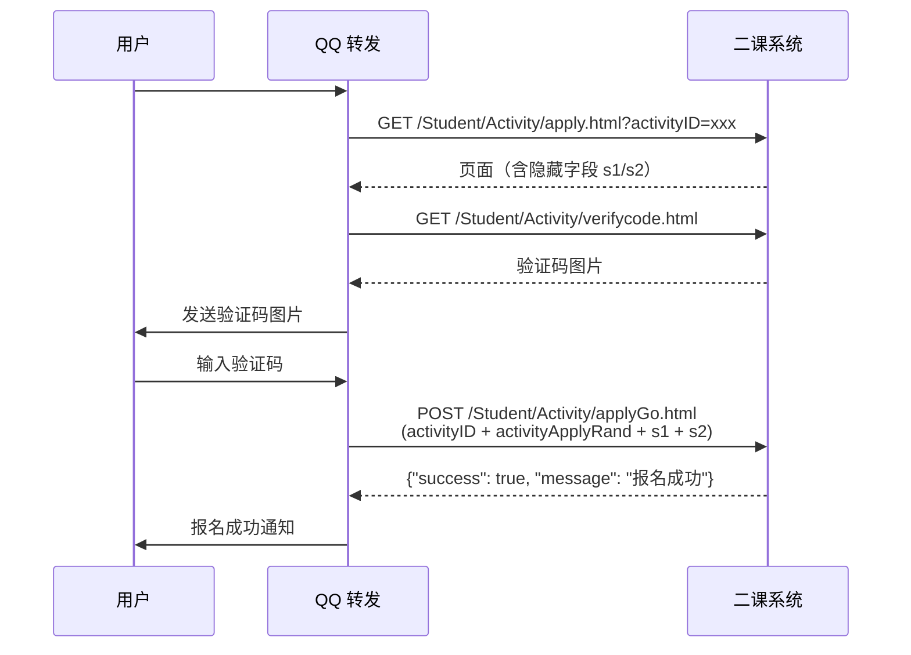
```mermaid
sequenceDiagram
    participant User as 用户
    participant Bot as QQ 转发
    participant SClass as 二课系统

    User->>Bot: #报名 <活动ID>
    Bot->>SClass: GET /Student/Activity/apply.html?activityID=xxx
    SClass-->>Bot: 页面（含隐藏字段 s1/s2）
    Bot->>SClass: GET /Student/Activity/verifycode.html
    SClass-->>Bot: 验证码图片
    Bot->>User: 发送验证码图片
    User->>Bot: 输入验证码
    Bot->>SClass: POST /Student/Activity/applyGo.html<br/>(activityID + activityApplyRand + s1 + s2)
    SClass-->>Bot: {"success": true, "message": "报名成功"}
    Bot->>User: 报名成功通知
```

**请求参数**（`applyGo.html`）：

| 参数 | 必填 | 说明 |
|------|------|------|
| `activityID` | 是 | 活动 ID |
| `activityApplyRand` | 是 | 验证码 |
| `s1` | 是 | 页面隐藏字段 |
| `s2` | 是 | 页面隐藏字段 |

**接口常量**：

| 常量 | 值 |
|------|-----|
| `ACTIVITY_DETAIL_URL` | `{BASE_URL}/Student/Activity/apply.html` |
| `ACTIVITY_VERIFYCODE_URL` | `{BASE_URL}/Student/Activity/verifycode.html` |
| `ACTIVITY_APPLY_GO_URL` | `{BASE_URL}/Student/Activity/applyGo.html` |

### 10.4 活动状态码

活动状态有多个来源，不同接口返回的状态名称和编码逻辑不同，以下统一汇总。

#### 10.4.1 原始 API 状态码（`ACTIVITY_STATUS_MAP`）

定义于 `secondclass/secondclass_tool.py` 第 1496 行，用于 API 返回的 `status` 字段直接映射：

| 状态码 | 状态名 | 说明 |
|--------|--------|------|
| `0` | 草稿 | 未发布 |
| `1` | 待审核 | 等待审核 |
| `2` | 审核未通过 | 审核被拒 |
| `3` | 报名中 | 可报名 |
| `4` | 报名结束 | 截止报名 |
| `5` | 活动中 | 活动进行中 |
| `6` | 已结束 | 活动已结束 |
| `7` | 已取消 | 活动已取消 |

#### 10.4.2 "我的活动"标签页映射（`MY_ACTIVITY_TABS` + `TAB_STATUS`）

从"我的活动"页面的服务端渲染标签页解析而来，`tab_id` 映射为 `(status_code, status_name)`：

| 标签页 ID | 状态名 | 映射 status_code | 说明 |
|-----------|--------|-----------------|------|
| `1` | 报名中 | `3` | 已报名的活动，报名进行中 |
| `2` | 活动中 | `5` | 活动正在进行中 |
| `5` | 未开始 | `0` | **已报名但活动尚未开始**，区别于 API 的"草稿"含义（来源：`TAB_STATUS` + `MY_ACTIVITY_TABS`） |
| `3` | 已结束 | `6` | 活动已结束（AJAX 分页，`TAB_DEFAULT_STATUS`） |
| `4` | 其它 | `""` | 其他状态（AJAX 分页，`TAB_DEFAULT_STATUS`） |

> `tab=5 ("未开始")` 的 `status_code` 在 DB 中存为 `"0"`，但语义上是"已报名且活动未开始"，与原始 API 的 `"0"="草稿"` 不同。代码中通过 `tab_id` 上下文区分。

#### 10.4.3 详情页解析状态名

从活动详情页 `apply.html` 的 CSS class 提取（`secondclass_tool.py` 第 1738 行）：

- **`报名未开始`**：从页面 `span.mui-btn-danger` / `span.btn.red` / `span.baom` 元素提取的文本，不通过 `status_code` 编码
- **`报名中`** / **`已结束`** / **`已报名`**：同源提取

代码中通过以下逻辑统计报名未开始的活动（`discover_new_activities()` 第 2748 行）：
```python
status = detail.get("status_name", "")
if "未开始" in status:
    upcoming += 1
```

> **注意**：旧版本中此处会 `continue` 跳过"未开始"活动，导致其无法录入 detail 表。
> 当前版本已修复，**仅计数不跳过**，所有活动（含"报名未开始"、"活动未开始"）均正常录入。

#### 10.4.4 其他派生状态

| 来源 | 状态名 | 说明 |
|------|--------|------|
| `_infer_activity_status()` | 报名失败 | `applyStatus == 2` 时返回 |
| `_infer_activity_status()` | 已取消 | `isClosed == 1` 时返回 |

### 10.5 活动列表字段

| JSON 字段 | 类型 | 映射字段 | 说明 |
|-----------|------|---------|------|
| `activityID` | int | `activity_id` | 活动 ID |
| `activityName` | string | `activity_name` | 活动名称 |
| `moduleName` | string | `module_name` | 模块名称 |
| `moduleID` | int | `module_id` | 模块 ID |
| `score` | float | `score` | 积分 |
| `organizerName` | string | `organizer` | 主办方 |
| `startDate` | int | `start_date` | 开始时间（Unix 时间戳） |
| `endDate` | int | `end_date` | 结束时间（Unix 时间戳） |
| `applyStartDate` | int | `apply_start` | 报名开始时间 |
| `applyEndDate` | int | `apply_end` | 报名结束时间 |
| `status` | int | `status_code` | 状态码 |
| `status2Name` | string | `status_name` | 状态名称 |
| `checkAfterApply` | int | `check_after_apply` | 审核标志（0/1/2） |
| `img` | string | `img` | 图片文件名 |
| `isClosed` | int | `is_closed` | 是否关闭 |

### 10.6 自动积分相关 API

以下接口主要用于 `secondclass_auto_score.py` 的自动化操作：

| 接口 | 方法 | 说明 | 返回格式 |
|------|------|------|---------|
| `/Student/Activity/verifycode.html` | GET | 获取报名验证码图片 | 图片 / HTML |
| `/Student/Activity/applyGo.html` | POST | 提交报名（activityID + activityApplyRand + s1 + s2） | JSON |
| `/Student/Activity/applyCancel.html` | POST | 取消报名 | JSON |
| `/Student/My/myActivitySummary.html` | GET/POST | 提交活动总结（GET获取session，POST提交multipart） | HTML |
| `/Student/My/getActivityNoSign.html` | POST | 获取未签到活动列表 | JSON |
| `/Student/My/getActivityNoSummary.html` | POST | 获取未提交总结活动列表 | JSON |
| `/Student/My/activityNoSign.html` | GET | 未签到活动页面 | HTML |
| `/Student/My/activityNoSummary.html` | GET | 未提交总结活动页面 | HTML |
| `/Student/My/activityListGps.html` | GET | GPS签到活动列表 | HTML |

**签到/签退端点探针**（`probe_endpoints` 遍历列表）：

| 类别 | 候选路径 |
|------|---------|
| 签到 | `/Student/Activity/sign.html`, `signIn.html`, `doSign.html`, `signGo.html`, `qrSign.html`, `scanSign.html` |
| GPS签到 | `/Student/My/activityListGps.html`, `signGps.html`, `/Student/Activity/gpsSign.html` |
| 签退 | `/Student/Activity/signOut.html`, `qiantui.html`, `/Student/My/signOut.html`, `activitySignOut.html` |
| 提交总结 | `/Student/My/myActivitySummary.html`, `/Student/Activity/submitSummary.html`, `/Student/My/summary.html` |

### 10.7 签到/签退接口（`signOnTV`）

签到与签退共用同一个 Admin 端投屏页面，通过 `isSignOut` 参数区分模式。

**接口地址**：

| 项目 | 值 |
|------|-----|
| URL | `/Admin/Index/signOnTV.html` |
| 方法 | GET |
| 认证 | Cookie: `SSID=xxx`（学生端携带 SSID 即可调用此 Admin 端点） |

**请求参数**：

| 参数 | 必填 | 说明 |
|------|------|------|
| `activityID` | 是 | 活动 ID |
| `channelID` | 是 | 渠道 ID（二维码场景通常为 `5`） |
| `rand` | 是 | 一次性随机数/token（扫码场景必须传二维码里解出的真值） |
| `isSignOut` | 是 | `0`=签到，`1`=签退 |

**代码函数**（`secondclass/secondclass_tool.py`）：

```python
def submit_sign(sess, activity_id, *, sign_out=False, channel_id=5, rand=None) -> dict:
    """二课签到 / 签退（共用 Admin/Index/signOnTV.html）。

    Args:
        sess: 已认证的 requests.Session（含 SSID cookie）。
        activity_id: 活动 ID。
        sign_out: True=签退，False=签到。
        channel_id: 渠道（大屏渠道默认 5）。
        rand: 二维码中的 rand token（必须传真值，随机数可能被服务器拒绝）。

    Returns:
        {"success": bool, "message": str, "raw": <原始响应文本或dict>}

    Raises:
        ActivitySignError: HTTP 异常或服务器返回明确失败。
        SecondClassAuthError: SSID 失效（302→登录页）。
    """
```

**响应处理**：
- `200` + JSON → 直接解析
- `200` + HTML → 含 `"成功"` 关键词视为成功
- `301/302` → 检查是否重定向到登录页（会话过期）

**常量**：
```python
SIGN_ON_TV_URL = "https://2class.cqtbi.edu.cn/Admin/Index/signOnTV.html"
```

### 10.8 二维码签到/签退流程

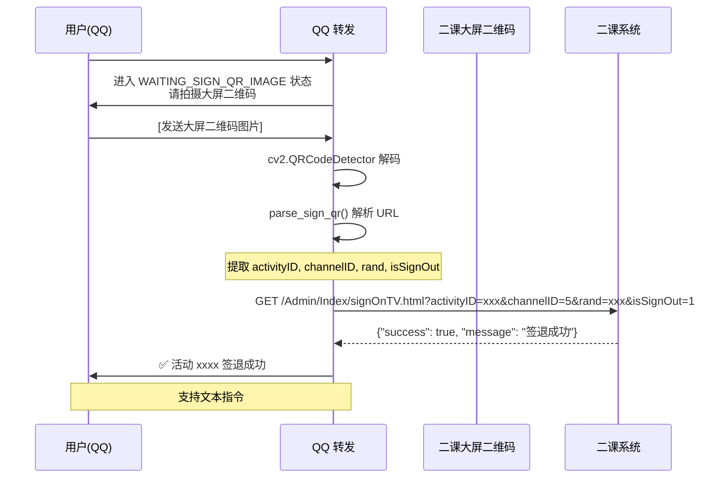
```mermaid
sequenceDiagram
    participant User as 用户(QQ)
    participant Bot as QQ 转发
    participant QR as 二课大屏二维码
    participant SClass as 二课系统

    User->>Bot: #扫码签到
    Bot->>User: 进入 WAITING_SIGN_QR_IMAGE 状态<br/>请拍摄大屏二维码
    User->>Bot: [发送大屏二维码图片]
    Bot->>Bot: cv2.QRCodeDetector 解码
    Bot->>Bot: parse_sign_qr() 解析 URL
    Note over Bot: 提取 activityID, channelID, rand, isSignOut
    Bot->>SClass: GET /Admin/Index/signOnTV.html?activityID=xxx&channelID=5&rand=xxx&isSignOut=1
    SClass-->>Bot: {"success": true, "message": "签退成功"}
    Bot->>User: ✅ 活动 xxxx 签退成功

    Note over User,Bot: 支持文本指令 #签到 <ID> / #签退 <ID><br/>直接提交无需扫码
```

### 9.9 预约报名流程

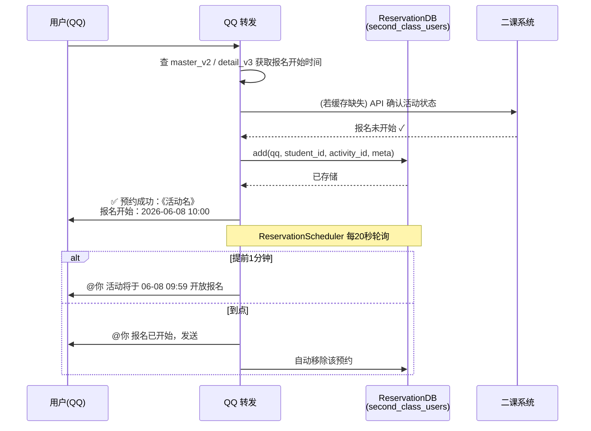
```mermaid
sequenceDiagram
    participant User as 用户(QQ)
    participant Bot as QQ 转发
    participant DB as ReservationDB<br/>(second_class_users)
    participant SClass as 二课系统

    User->>Bot: #预约报名 121582
    Bot->>Bot: 查 master_v2 / detail_v3 获取报名开始时间
    Bot->>SClass: (若缓存缺失) API 确认活动状态
    SClass-->>Bot: 报名未开始 ✓
    Bot->>DB: add(qq, student_id, activity_id, meta)
    DB-->>Bot: 已存储
    Bot->>User: ✅ 预约成功：《活动名》<br/>报名开始：2026-06-08 10:00

    Note over Bot,DB: ReservationScheduler 每20秒轮询

    alt 提前1分钟
        Bot->>User: @你 活动将于 06-08 09:59 开放报名
    else 到点
        Bot->>User: @你 报名已开始，发送 #报名 121582
        Bot->>DB: 自动移除该预约
    end
```

---


## 十一、附录 — 代码风格

### 10.1 命名约定

| 类型 | 约定 | 示例 |
|------|------|------|
| 模块/包 | 小写+下划线 | `sso_common.py`, `core/` |
| 类 | PascalCase | `SecondClassMasterDB`, `CommandHandler` |
| 函数/方法 | 小写+下划线 | `obtain_session()`, `fetch_and_save()` |
| 常量 | 大写+下划线 | `BASE_URL`, `APPID`, `MAX_PER_CHART` |
| 私有函数 | 前导单下划线 | `_cleanup_loop()`, `_cache` |

### 10.2 导入顺序

```
1. 标准库 (os, sys, json, ...)
2. 第三方库 (requests, bs4, pillow, ...)
3. 项目内部模块 (from sso import ...)
```

### 10.3 异常处理

- 底层函数抛出具体异常（`ValueError`, `ConnectionError`, `SecondClassAuthError`, `ScheduleError`）
- 顶层入口统一捕获并记录日志
- 禁止静默捕获异常（`except: pass`）
- 自定义异常类：`SecondClassAuthError`（二课认证失败）、`OneBotError`（WebSocket 连接错误）、`ActivityApplyError`（活动报名异常）、`ScheduleError`（课表获取异常）

### 10.4 红线规则

| 规则 | 说明 |
|------|------|
| 禁止提交 | 不提交 `accounts.json`, `users.db`, `venv/`, `__pycache__/`, `.env` |
| 禁止后台线程操作 UI | 所有 Tkinter GUI 操作必须在主线程 |
| 禁止静默异常 | 所有 `except` 块必须记录日志或输出错误信息 |
| 禁止硬编码 | 配置参数使用常量/配置文件，不硬编码在代码中 |
| 敏感信息脱敏 | 日志中密码/token 使用 `***` 替代 |

---

## Changelog

| 版本 | 日期 | 变更内容 |
|------|------|---------|
| v2.1 | 2026-06-08 | 新增 §九 三端数据流全景：QQ转发工具、二课调度工具、课表工具之间的完整数据流分析与依赖关系（含数据流表、调用链、凭证共享链、使用者矩阵、mermaid 架构图）；章节重编号：旧 §九→§十，§十→§十一 |
| v1.6 | 2026-06-07 | 新增 `second_class_user_activities` 表（仅存 qq/student_id/activity_id），记录用户未结束活动（报名中+活动中+未开始）；新增 `SecondClassUserActivityDB` 类与 `fetch_and_store_my_unfinished_activities()` 函数；`fetch_and_store_master_data()` 移除 Step2（我的活动不再写入 master 表），改为调度器中独立拉取新表；更新数据流全景图与 DB 表结构文档 |
| v1.5 | 2026-06-07 | 新增 §4.15.1 活动总表（`second_class_master_v2`）录入逻辑与数据流文档（含 `fetch_and_store_master_data()` 四步流程、`fetch_activities_can_apply()`、`fetch_all_my_activities()` 详解、`upsert_activities()` 写入逻辑）；新增 §4.15.2 活动详情表（`second_class_activity_detail_v3`）录入逻辑与数据流文档（含三层解析策略、`_LABEL_FIELD_MAP` 标签→字段映射表、3 个写入入口）；新增 §4.15.3 数据流全景图（mermaid 流程图）；更新 §4.16 调度器文档，补充详情拉取参数和限制说明 |
| v1.4 | 2026-06-05 | 新增 `schedule/jwgl_client.py` JWGL 教务系统客户端（从 schedule_tool 重构提取，新增成绩查询 `get_grades()`）；新增 `secondclass_auto_score.py` 二课自动积分工具（status/signup/probe/summary/monitor/run 6大子命令，含 ddddocr 验证码识别）；新增 `sso_to_ssid.py` SSID 转换工具及 `convert_to_ssid()` 函数；新增凭证转换链文档 §7.5（含转换流程图、存储位置表、函数映射表、凭证层级图）；新增成绩查询 API 文档（`cqtbi-api.md` §3.3）；新增二课自动积分 API 文档（`DEVELOPER.md` §9.6）；更新 4.1 核心功能表和模块编号 |
| v1.2 | 2026-06-05 | 新增 `secondclass/secondclass_activity_chart.py` 活动卡片/列表渲染模块；`SecondClassMasterDB` 新增 `delete_by_activity_id()`、`get_by_student_id()`；`SecondClassActivityDetailDB` 新增 `delete_by_activity_id()`；`fetch_and_store_all_activity_details()` 增加空活动名检测+记录删除；新增 #二课列表、#查看二课 指令；修复 DEVELOPER.md 中 v2→v3 表名 |
| v1.1 | 2026-06-04 | 新增 `second_class_activity_detail_v3` 活动详情表；新增 `SecondClassActivityDetailDB`、`fetch_activity_detail_page()`、`fetch_and_store_all_activity_details()`；调度器自动拉取活动详情；新增 `secondclass_image.py` 二课信息图渲染；新增 #二课图表 指令 |
| v1.0.3 | 2026-05-xx | `secondclass_tool.py` 重构优化：四类积分拆解（思想/劳动/文艺/志愿）；时长提取；全学年积分；SSID 缓存；三级调度间隔 |
| v1.0.2 | 2026-05-xx | 二课系统重大升级：`second_class_master_v2` 活动总表；定时调度；多标签页分页拉取；`SecondClassScheduler` 自动调度器；Tkinter 调度 GUI |
| v1.0.1 | 2026-04-xx | 二课系统增强：字段扩展；SSO 会话过期检测修复 |
| v1.0.0 | 2026-03-xx | 初始版本 |
