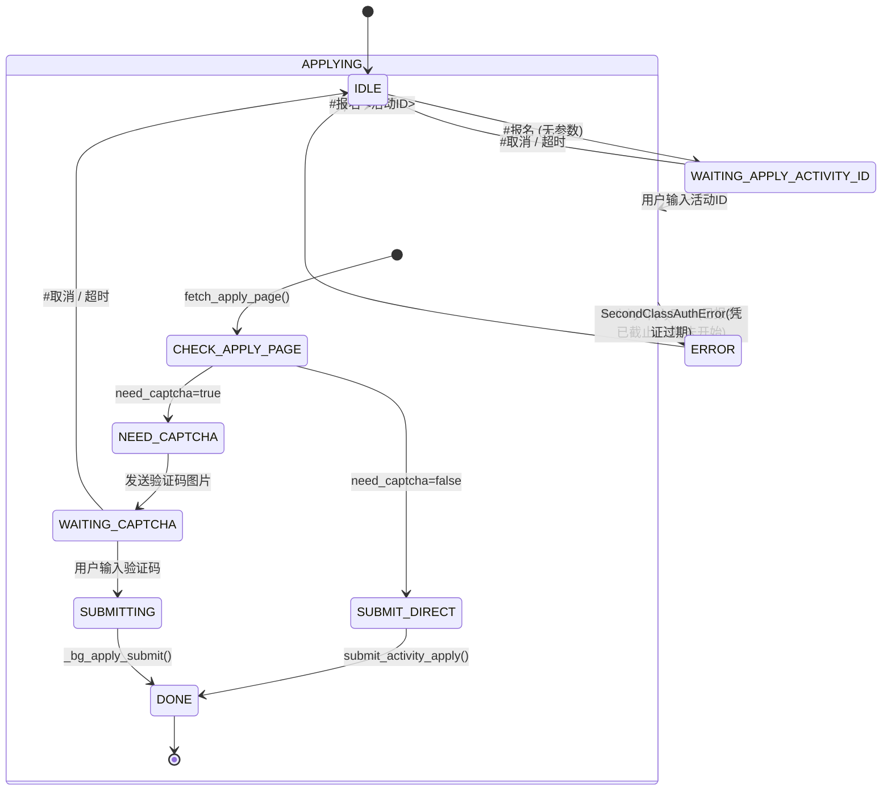

## 需求概述


- 报名功能的完整实现架构
- 核心代码文件和函数
- 业务数据流和状态流转
- 数据库表结构设计

## 核心功能

1. **#报名 [活动ID]** — 二课活动报名命令，支持带参数直接报名和无参数交互式输入活动ID
2. **#我的二课** — 查询用户未结束活动（报名中/活动中/未开始），渲染活动卡片合并转发
3. **后台定时拉取** — 调度器自动拉取所有用户的未结束活动并存入独立表
4. **状态检测** — 自动检测已报名/已截止/人数已满/报名未开始等边界情况并提示用户

## 技术方案

### 技术栈

| 层 | 技术 | 用途 |
| --- | --- | --- |
| 语言 | Python 3.10+ | 全部代码 |
| QQ协议 | OneBot v11 (WebSocket) | 命令收发 |
| HTTP | requests | 二课系统API调用 |
| HTML解析 | BeautifulSoup | 解析报名页面提取字段 |
| 数据库 | SQLite (users.db) | 存储未结束活动记录 |
| 图片渲染 | Pillow | 活动卡片渲染 |
| 日志 | logging | 统一日志记录 |


### 实现架构

```
┌─────────────────────────────────────────────────────┐
│                    会话层 (QQ 转发器)                  │
│  qq/monitor_forward.py    qq/qq_forward.py          │
│                                                      │
│  #报名 [活动ID] ──> _cmd_apply()                    │
│  #报名 (无参数) ──> WAITING_APPLY_ACTIVITY_ID       │
│  用户输入验证码 ──> WAITING_APPLY_CAPTCHA            │
│  #我的二课    ──> _cmd_my_er()                      │
└──────────────────────┬──────────────────────────────┘
                       │
┌──────────────────────▼──────────────────────────────┐
│                    业务层 (二课 API)                  │
│              secondclass/secondclass_tool.py         │
│                                                      │
│  fetch_apply_page()        解析报名页/提取s1/s2      │
│  fetch_verifycode_image()  获取验证码图片            │
│  submit_activity_apply()   提交报名请求              │
│  fetch_and_store_my_unfinished_activities()          │
└──────────────────────┬──────────────────────────────┘
                       │
┌──────────────────────▼──────────────────────────────┐
│                    数据层 (DB 操作)                   │
│              secondclass/secondclass_tool.py         │
│                                                      │
│  SecondClassUserActivityDB                           │
│  ┌─ second_class_user_activities 表 ─┐              │
│  │ id, qq, student_id, activity_id,  │              │
│  │ fetched_at, can_apply             │              │
│  └────────────────────────────────────┘              │
│  方法: upsert_activities(), get_by_student_id(),     │
│        get_activity_ids_by_student_id(),              │
│        delete_by_activity_id(), clear_by_student_id()│
└──────────────────────────────────────────────────────┘
```

### 报名流程状态机



### 核心数据流

```
用户发送 "#报名 123456"
  │
  ├→ CMD_APPLY 指令匹配 (monitor_forward.py:172 / qq_forward.py)
  │
  ├→ _cmd_apply() (monitor_forward.py:2332)
  │    ├─ find_account_by_qq() → 获取用户凭证 (portal_ticket)
  │    ├─ obtain_secondclass_session_from_user() → 获取二课 SSID 会话
  │    ├─ fetch_apply_page(sess, activity_id) → 解析报名页
  │    │    ├─ GET /Student/Activity/apply.html?activityID=xxx
  │    │    ├─ 检测已报名(ok2.png) → 抛 ActivityApplyError
  │    │    ├─ 检测报名已截止/人数已满 → 抛 ActivityApplyError
  │    │    ├─ 提取隐藏字段 s1, s2 (来自 <form> 的 <input>)
  │    │    └─ 返回 {s1, s2, activity_name, need_captcha, status_name}
  │    │
  │    ├─ [如果 need_captcha=false] 直接 submit_activity_apply()
  │    │    └─ POST /Student/Activity/applyGo.html {activityID, activityApplyRand, s1, s2}
  │    │
  │    └─ [如果 need_captcha=true] 需要验证码
  │         ├─ fetch_verifycode_image(sess)
  │         │    └─ GET /Student/Activity/verifycode.html → 返回验证码图片 bytes
  │         ├─ 设置会话状态 WAITING_APPLY_CAPTCHA
  │         └─ 发送验证码图片给用户 + "请输入验证码"
  │
  ├→ 用户输入验证码 "8848"
  │    └─ WAITING_APPLY_CAPTCHA 状态处理
  │         └─ _bg_apply_submit(user_id, rcode)
  │              ├─ get_session() → 获取存储的 session/apply_data
  │              ├─ submit_activity_apply(sess, activity_id, rcode, s1, s2)
  │              │    └─ POST applyGo.html → 返回 {success, message}
  │              └─ 回复 "报名成功！活动：xxx" 或 "报名失败：xxx"
  │
  └→ 完成/清理会话
```

### 核心文件清单

| 文件 | 行数变化 | 职责 |
| --- | --- | --- |
| `secondclass/secondclass_tool.py` | +249 | **核心业务层**：SecondClassUserActivityDB 类 + fetch_apply_page/fetch_verifycode_image/submit_activity_apply/fetch_and_store_my_unfinished_activities 函数 + ActivityApplyError 异常 |
| `qq/monitor_forward.py` | +173 | **新版QQ命令处理器**：CMD_APPLY/#我的二课 命令定义、_cmd_apply()、_bg_apply_submit()、_cmd_my_er()、WAITING_APPLY_ACTIVITY_ID 会话处理 |
| `qq/qq_forward.py` | +338 | **旧版QQ命令处理器**：_LoginState + _LoginSession 扩展、_cmd_apply()、_bg_apply_submit()、_cmd_my_er() |
| `core/user_session.py` | +1 | 新增 `WAITING_APPLY_ACTIVITY_ID = 9` 会话状态枚举值 |
| `secondclass/secondclass_scheduler.py` | +12 | 调度器循环中增加 fetch_and_store_my_unfinished_activities() 调用 |
| `qq/help_image.py` | +3 | 帮助文本新增 "#报名 [活动ID]"、"#我的二课" 指令说明 |


### 5个核心函数 (均位于 secondclass/secondclass_tool.py)

**1. fetch_apply_page(sess, activity_id) -> dict**

- 请求 `GET /Student/Activity/apply.html?activityID=xxx`
- 用 BeautifulSoup 解析 HTML，检测状态（已报名/已截止/人数已满/未开始）
- 提取隐藏表单字段 `<input name="s1">` 和 `<input name="s2">`
- 返回 `{s1, s2, activity_name, need_captcha, status_name}`

**2. fetch_verifycode_image(sess) -> bytes**

- 请求 `GET /Student/Activity/verifycode.html`
- 返回验证码图片的 bytes 数据
- 处理返回 HTML 中内嵌图片的兜底逻辑

**3. submit_activity_apply(sess, activity_id, captcha_code, s1, s2) -> dict**

- 请求 `POST /Student/Activity/applyGo.html`
- 参数: activityID, activityApplyRand, s1, s2
- 返回 `{success: bool, message: str}`
- 处理非 JSON 响应（认证失效返回 HTML）的兜底

**4. fetch_and_store_my_unfinished_activities(sess, student_id, qq) -> dict**

- 拉取 myActivity.html 的标签页1(报名中)+2(活动中)+5(未开始)
- 提取所有 activity_id
- 写入 second_class_user_activities 表（先清空旧记录）
- 返回统计信息 `{tab1_count, tab2_count, tab5_count, total}`

**5. SecondClassUserActivityDB 类**

- 管理 `second_class_user_activities` 表
- upsert_activities(): 批量插入活动ID（去重）
- get_by_student_id(): 按学号查所有未结束活动
- get_activity_ids_by_student_id(): 仅查 activity_id 列表
- delete_by_activity_id(): 按活动ID删除
- clear_by_student_id(): 清空指定学生记录

### 2个DB表

**second_class_user_activities 表**（新增）

| 字段 | 类型 | 说明 |
| --- | --- | --- |
| id | INTEGER PK AUTO | 自增主键 |
| qq | INTEGER | QQ号 |
| student_id | TEXT NOT NULL | 学号 |
| activity_id | TEXT NOT NULL | 活动ID |
| fetched_at | TEXT | 抓取时间 |
| can_apply | TEXT | 是否可报名（兼容旧表） |
| 唯一索引 | (student_id, activity_id) | 防止重复记录 |
| 索引 | (qq) | 加速按QQ查询 |


### 异常体系

- **SecondClassAuthError** — 二课认证过期，提示用户重新扫码登录
- **ActivityApplyError** — 报名业务异常，包含具体原因：
- "你已经报名活动「xxx」"（基于 ok2.png 检测）
- "活动「xxx」报名未开始"
- "活动「xxx」报名已截止"
- "活动「xxx」报名人数已满"

### 执行注意事项

1. **会话管理**：新版 (monitor_forward.py) 使用 core/user_session.py 的全局会话管理器，旧版 (qq_forward.py) 使用独立的 _LoginSession 字典，两者互不兼容
2. **凭证查找**：新版通过 accounts.json 查找凭证，旧版通过 users.db 的 UserDB 查找
3. **缓存策略**：活动卡片渲染使用缓存（CARD_DIR / {aid}.png），仅缓存未命中时实时拉取
4. **懒加载 Session**：_cmd_my_er() 中首次缓存未命中时才获取二课 Session，避免无效请求
5. **验证码免输**：当 fetch_apply_page 返回 need_captcha=False 时，直接提交报名，无需用户输入验证码

## Agent 扩展使用计划

### SubAgent

- **code-explorer**
- 用途：在第一步中定位 commit d312b4c 涉及的所有核心文件变更，提取 _cmd_apply、_bg_apply_submit、fetch_apply_page、fetch_verifycode_image、submit_activity_apply 等核心函数的完整代码片段
- 预期产出：每个核心函数的行号范围 + 完整代码内容

- **SSO Tools Guide**
- 用途：在第一步中分析报名功能的3层架构和与项目现有模块（二课认证、会话管理）的交互关系
- 预期产出：架构数据流图 + 模块依赖关系分析

### Skill

- **guide**
- 用途：在第三步编写 plan 文档时，如需要参考项目现有文档格式（CLAUDE.md / DEVELOPER.md）中的架构描述风格，可激活此 skill
- 预期产出：符合项目文档规范的 plan 文档