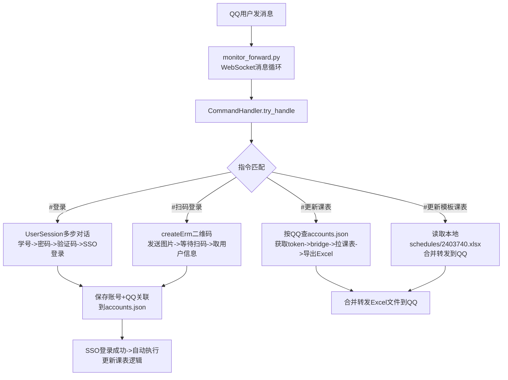

## 产品概述

对现有 QQ 机器人（monitor_forward.py）扩展指令系统，实现 CQTBI 教务系统全链路操作，支持多用户独立使用。

## 核心功能

### 1. `#更新模板课表`（原名 `#更新我的课表`）

- 所有人可用（移除管理员限制）
- 直接读取本地 `schedules/2403740_2025-2026-2.xlsx` 文件，以合并转发方式发送给用户
- 不涉及网络请求，快速响应

### 2. `#登录` 指令（SSO 密码登录）

- 所有人可用
- 多步对话流程：
- 第1步：要求用户发送学号（自动等待回复）
- 第2步：要求用户发送密码（自动等待回复）
- 第3步：拉取验证码图片，以 `image` 类型发送到 QQ
- 第4步：接收用户填写的验证码，执行 SSO 完整登录（sso_login → portal_login → bridge）
- 成功时：自动执行更新课表逻辑，保存账号与 QQ 关联
- 失败时：以合并转发形式发送报错日志给用户

### 3. `#扫码登录` 指令（二维码登录）

- 所有人可用
- 调用 OAuth2 `createErm` 接口生成动态二维码
- 以 `image` 类型发送二维码图片到 QQ
- 扫码成功后获取用户学校信息（姓名、学号、部门等），提示登录成功
- 自动关联 QQ 号与学号，保存 token/ticket 到 accounts.json

### 4. `#更新课表` 指令

- 核对该用户 QQ 号关联的 token/ticket
- 调取 JWGL 课表接口获取课表 HTML，解析为结构化数据
- 导出 Excel → 以合并转发方式发送文件到 QQ
- 核心逻辑复用 `JWGLClient` 现有方法

## 多用户支持

- accounts.json 扩展为多用户存储，增加 `qq` 字段关联 QQ 号
- 每个指令根据触发用户 QQ 查找对应账号信息
- 会话状态管理：每个 QQ 独立跟踪多步对话进度

## 技术栈

- Python 3.8+（现有项目）
- WebSocket 连接 NapCatQQ（现有 monitor_forward.py 的 websocket-client 库）
- requests + cryptography（现有 SSO 登录库）
- BeautifulSoup（现有课表解析）
- openpyxl（现有 Excel 导出）

## 实现方案

### 系统架构



### 文件修改/新增计划

**修改文件：**

1. `monitor_forward.py` — CommandHandler 扩展，新增 4 个指令处理逻辑
2. `accounts.json` — 扩展数据结构，支持多账号+QQ关联

**新增文件：**

3. `user_session.py` — 会话状态管理器，管理多步对话跟踪
4. `account_store.py` — 账号存储工具，读写 accounts.json 的 QQ 关联查询

### 关键设计决策

1. **会话状态管理（user_session.py）**

- 状态枚举：IDLE / WAITING_STUDENT_ID / WAITING_PASSWORD / WAITING_CAPTCHA / WAITING_QR_SCAN
- 每个 QQ 独立维护上下文（student_id, password, acc_key, session 等）
- 全局字典 `{user_id: UserSession}`，使用 threading.Lock 保证线程安全
- 定时清理：启动后台线程每 60 秒扫描，清理超过 5 分钟无操作的空闲会话

2. **账号存储（account_store.py）**

- `find_account_by_qq(qq: int) -> dict | None`
- `save_account(qq: int, account_data: dict) -> None`
- `update_account(qq: int, key: str, value) -> None`
- 保持向后兼容：现有无 qq 字段的账号仍然可读

3. **`#登录` 指令处理流程**

- 用户发 `#登录` → 创建 UserSession(WAITING_STUDENT_ID) → 回复"请输入学号"
- 用户发学号 → 检查格式 → 回复"请输入密码" → 保存储存
- 用户发密码 → 调用 JWGLClient.begin_sso() 获取验证码 bytes → 以 image 类型发送到 QQ → 状态变为 WAITING_CAPTCHA
- 用户发验证码 → 调用 JWGLClient.sso_login() → portal_login() → bridge() → get_schedule()
- 成功后调用 account_store.save_account(qq, {...}) 保存全部字段

4. **`#扫码登录` 指令处理流程**

- 用户发 `#扫码登录` → 创建新 session
-  requests 请求 `http://szxy.cqtbi.edu.cn/oauth2/v1/createErm?seq={random}&v={device}` 获取二维码 bytes
- 以 image 类型发送到 QQ
- 轮询扫码结果：循环请求某个状态检查端点或等待用户手动确认
- 获取到 code 后调用 `exchange_code_for_token()` 获取 access_token
- 调用 `http://szxy.cqtbi.edu.cn/oauth2/v1/access_user`（POST, 传 access_token）获取用户信息
- 保存账号信息到 accounts.json

5. **`#更新课表` 指令处理流程**

- 根据 user_id 调用 account_store.find_account_by_qq()
- 未找到则回复"请先使用 #登录 或 #扫码登录"
- 根据 portal_ticket 调用 JWGLClient.bridge() → get_schedule() → save_excel()
- 合并转发 Excel 文件到群/私聊

6. **`#更新模板课表` 指令处理流程**

- 直接读取固定路径 `schedules/2403740_2025-2026-2.xlsx`
- 以合并转发方式发送文件
- 若文件不存在则提示"模板课表文件不存在"

7. **指令匹配逻辑重构**

- 先匹配精确指令名（`#更新模板课表`/`#登录`/`#扫码登录`/`#更新课表`）
- 再检查是否有待处理的会话（WAITING 状态）
- 都没命中则返回 False 走原有转发逻辑
- 移除管理员权限检查，改为每个指令内部按需校验

### 实现注意事项

**性能：**

- SSO 登录涉及多个 HTTP 请求，全部在后台线程执行
- 扫码轮询使用较短超时（每个轮询间隔 3 秒，最多 120 秒超时）

**日志：**

- 复用现有 logger，密码/access_token 等敏感信息使用 sso_common.redact() 脱敏
- 每个指令的执行结果用 INFO 级别记录

**兼容性：**

- 不破坏现有消息转发逻辑
- `#更新模板课表` 保持与现有 `#更新我的课表` 相同的回复格式
- accounts.json 旧格式自动兼容

### 目录结构（仅显示新增/修改文件）

```
d:\code\private\class\
├── monitor_forward.py      # [MODIFY] 扩展 CommandHandler，新增4个指令处理
├── accounts.json           # [MODIFY] 数据结构扩展，增加 qq 字段支持多用户
├── user_session.py         # [NEW] 会话状态管理器，多步对话跟踪与超时清理
├── account_store.py        # [NEW] 账号存储工具，accounts.json 的 QQ 关联查询
└── schedules/
    └── 2403740_2025-2026-2.xlsx  # [使用] 模板课表文件
```

# Agent Extensions

无